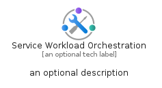
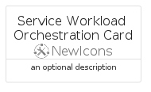
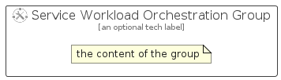

# ServiceWorkloadOrchestration


```text
azure/Item/NewIcons/ServiceWorkloadOrchestration
```

```text
include('azure/Item/NewIcons/ServiceWorkloadOrchestration')
```


| Illustration | ServiceWorkloadOrchestration | ServiceWorkloadOrchestrationCard | ServiceWorkloadOrchestrationGroup |
| :---: | :---: | :---: | :---: |
|  |  |  |  |


## Sprites
The item provides the following sriptes:

- `<$ServiceWorkloadOrchestrationXs>`
- `<$ServiceWorkloadOrchestrationSm>`
- `<$ServiceWorkloadOrchestrationMd>`
- `<$ServiceWorkloadOrchestrationLg>`


## ServiceWorkloadOrchestration

### Load remotely
```plantuml
@startuml
' configures the library
!global $LIB_BASE_LOCATION="https://raw.githubusercontent.com/tmorin/plantuml-libs/master/distribution"

' loads the library's bootstrap
!include $LIB_BASE_LOCATION/bootstrap.puml

' loads the package bootstrap
include('azure/bootstrap')

' loads the Item which embeds the element ServiceWorkloadOrchestration
include('azure/Item/NewIcons/ServiceWorkloadOrchestration')

' renders the element
ServiceWorkloadOrchestration('ServiceWorkloadOrchestration', 'Service Workload Orchestration', 'an optional tech label', 'an optional description')
@enduml
```

### Load locally
```plantuml
@startuml
' configures the library
!global $INCLUSION_MODE="local"
!global $LIB_BASE_LOCATION="../../.."

' loads the library's bootstrap
!include $LIB_BASE_LOCATION/bootstrap.puml

' loads the package bootstrap
include('azure/bootstrap')

' loads the Item which embeds the element ServiceWorkloadOrchestration
include('azure/Item/NewIcons/ServiceWorkloadOrchestration')

' renders the element
ServiceWorkloadOrchestration('ServiceWorkloadOrchestration', 'Service Workload Orchestration', 'an optional tech label', 'an optional description')
@enduml
```

## ServiceWorkloadOrchestrationCard

### Load remotely
```plantuml
@startuml
' configures the library
!global $LIB_BASE_LOCATION="https://raw.githubusercontent.com/tmorin/plantuml-libs/master/distribution"

' loads the library's bootstrap
!include $LIB_BASE_LOCATION/bootstrap.puml

' loads the package bootstrap
include('azure/bootstrap')

' loads the Item which embeds the element ServiceWorkloadOrchestrationCard
include('azure/Item/NewIcons/ServiceWorkloadOrchestration')

' renders the element
ServiceWorkloadOrchestrationCard('ServiceWorkloadOrchestrationCard', 'Service Workload Orchestration Card', 'an optional description')
@enduml
```

### Load locally
```plantuml
@startuml
' configures the library
!global $INCLUSION_MODE="local"
!global $LIB_BASE_LOCATION="../../.."

' loads the library's bootstrap
!include $LIB_BASE_LOCATION/bootstrap.puml

' loads the package bootstrap
include('azure/bootstrap')

' loads the Item which embeds the element ServiceWorkloadOrchestrationCard
include('azure/Item/NewIcons/ServiceWorkloadOrchestration')

' renders the element
ServiceWorkloadOrchestrationCard('ServiceWorkloadOrchestrationCard', 'Service Workload Orchestration Card', 'an optional description')
@enduml
```

## ServiceWorkloadOrchestrationGroup

### Load remotely
```plantuml
@startuml
' configures the library
!global $LIB_BASE_LOCATION="https://raw.githubusercontent.com/tmorin/plantuml-libs/master/distribution"

' loads the library's bootstrap
!include $LIB_BASE_LOCATION/bootstrap.puml

' loads the package bootstrap
include('azure/bootstrap')

' loads the Item which embeds the element ServiceWorkloadOrchestrationGroup
include('azure/Item/NewIcons/ServiceWorkloadOrchestration')

' renders the element
ServiceWorkloadOrchestrationGroup('ServiceWorkloadOrchestrationGroup', 'Service Workload Orchestration Group', 'an optional tech label') {
    note as note
        the content of the group
    end note
}
@enduml
```

### Load locally
```plantuml
@startuml
' configures the library
!global $INCLUSION_MODE="local"
!global $LIB_BASE_LOCATION="../../.."

' loads the library's bootstrap
!include $LIB_BASE_LOCATION/bootstrap.puml

' loads the package bootstrap
include('azure/bootstrap')

' loads the Item which embeds the element ServiceWorkloadOrchestrationGroup
include('azure/Item/NewIcons/ServiceWorkloadOrchestration')

' renders the element
ServiceWorkloadOrchestrationGroup('ServiceWorkloadOrchestrationGroup', 'Service Workload Orchestration Group', 'an optional tech label') {
    note as note
        the content of the group
    end note
}
@enduml
```

