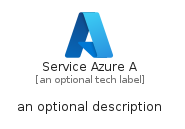
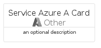
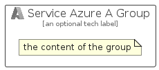

# ServiceAzureA


```text
azure/Item/Other/ServiceAzureA
```

```text
include('azure/Item/Other/ServiceAzureA')
```


| Illustration | ServiceAzureA | ServiceAzureACard | ServiceAzureAGroup |
| :---: | :---: | :---: | :---: |
|  |  |  |  |


## Sprites
The item provides the following sriptes:

- `<$ServiceAzureAXs>`
- `<$ServiceAzureASm>`
- `<$ServiceAzureAMd>`
- `<$ServiceAzureALg>`


## ServiceAzureA

### Load remotely
```plantuml
@startuml
' configures the library
!global $LIB_BASE_LOCATION="https://raw.githubusercontent.com/tmorin/plantuml-libs/master/distribution"

' loads the library's bootstrap
!include $LIB_BASE_LOCATION/bootstrap.puml

' loads the package bootstrap
include('azure/bootstrap')

' loads the Item which embeds the element ServiceAzureA
include('azure/Item/Other/ServiceAzureA')

' renders the element
ServiceAzureA('ServiceAzureA', 'Service Azure A', 'an optional tech label', 'an optional description')
@enduml
```

### Load locally
```plantuml
@startuml
' configures the library
!global $INCLUSION_MODE="local"
!global $LIB_BASE_LOCATION="../../.."

' loads the library's bootstrap
!include $LIB_BASE_LOCATION/bootstrap.puml

' loads the package bootstrap
include('azure/bootstrap')

' loads the Item which embeds the element ServiceAzureA
include('azure/Item/Other/ServiceAzureA')

' renders the element
ServiceAzureA('ServiceAzureA', 'Service Azure A', 'an optional tech label', 'an optional description')
@enduml
```

## ServiceAzureACard

### Load remotely
```plantuml
@startuml
' configures the library
!global $LIB_BASE_LOCATION="https://raw.githubusercontent.com/tmorin/plantuml-libs/master/distribution"

' loads the library's bootstrap
!include $LIB_BASE_LOCATION/bootstrap.puml

' loads the package bootstrap
include('azure/bootstrap')

' loads the Item which embeds the element ServiceAzureACard
include('azure/Item/Other/ServiceAzureA')

' renders the element
ServiceAzureACard('ServiceAzureACard', 'Service Azure A Card', 'an optional description')
@enduml
```

### Load locally
```plantuml
@startuml
' configures the library
!global $INCLUSION_MODE="local"
!global $LIB_BASE_LOCATION="../../.."

' loads the library's bootstrap
!include $LIB_BASE_LOCATION/bootstrap.puml

' loads the package bootstrap
include('azure/bootstrap')

' loads the Item which embeds the element ServiceAzureACard
include('azure/Item/Other/ServiceAzureA')

' renders the element
ServiceAzureACard('ServiceAzureACard', 'Service Azure A Card', 'an optional description')
@enduml
```

## ServiceAzureAGroup

### Load remotely
```plantuml
@startuml
' configures the library
!global $LIB_BASE_LOCATION="https://raw.githubusercontent.com/tmorin/plantuml-libs/master/distribution"

' loads the library's bootstrap
!include $LIB_BASE_LOCATION/bootstrap.puml

' loads the package bootstrap
include('azure/bootstrap')

' loads the Item which embeds the element ServiceAzureAGroup
include('azure/Item/Other/ServiceAzureA')

' renders the element
ServiceAzureAGroup('ServiceAzureAGroup', 'Service Azure A Group', 'an optional tech label') {
    note as note
        the content of the group
    end note
}
@enduml
```

### Load locally
```plantuml
@startuml
' configures the library
!global $INCLUSION_MODE="local"
!global $LIB_BASE_LOCATION="../../.."

' loads the library's bootstrap
!include $LIB_BASE_LOCATION/bootstrap.puml

' loads the package bootstrap
include('azure/bootstrap')

' loads the Item which embeds the element ServiceAzureAGroup
include('azure/Item/Other/ServiceAzureA')

' renders the element
ServiceAzureAGroup('ServiceAzureAGroup', 'Service Azure A Group', 'an optional tech label') {
    note as note
        the content of the group
    end note
}
@enduml
```

