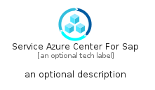
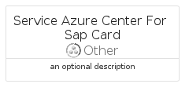
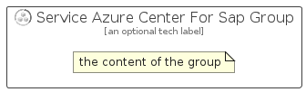

# ServiceAzureCenterForSap


```text
azure/Item/Other/ServiceAzureCenterForSap
```

```text
include('azure/Item/Other/ServiceAzureCenterForSap')
```


| Illustration | ServiceAzureCenterForSap | ServiceAzureCenterForSapCard | ServiceAzureCenterForSapGroup |
| :---: | :---: | :---: | :---: |
|  |  |  |  |


## Sprites
The item provides the following sriptes:

- `<$ServiceAzureCenterForSapXs>`
- `<$ServiceAzureCenterForSapSm>`
- `<$ServiceAzureCenterForSapMd>`
- `<$ServiceAzureCenterForSapLg>`


## ServiceAzureCenterForSap

### Load remotely
```plantuml
@startuml
' configures the library
!global $LIB_BASE_LOCATION="https://raw.githubusercontent.com/tmorin/plantuml-libs/master/distribution"

' loads the library's bootstrap
!include $LIB_BASE_LOCATION/bootstrap.puml

' loads the package bootstrap
include('azure/bootstrap')

' loads the Item which embeds the element ServiceAzureCenterForSap
include('azure/Item/Other/ServiceAzureCenterForSap')

' renders the element
ServiceAzureCenterForSap('ServiceAzureCenterForSap', 'Service Azure Center For Sap', 'an optional tech label', 'an optional description')
@enduml
```

### Load locally
```plantuml
@startuml
' configures the library
!global $INCLUSION_MODE="local"
!global $LIB_BASE_LOCATION="../../.."

' loads the library's bootstrap
!include $LIB_BASE_LOCATION/bootstrap.puml

' loads the package bootstrap
include('azure/bootstrap')

' loads the Item which embeds the element ServiceAzureCenterForSap
include('azure/Item/Other/ServiceAzureCenterForSap')

' renders the element
ServiceAzureCenterForSap('ServiceAzureCenterForSap', 'Service Azure Center For Sap', 'an optional tech label', 'an optional description')
@enduml
```

## ServiceAzureCenterForSapCard

### Load remotely
```plantuml
@startuml
' configures the library
!global $LIB_BASE_LOCATION="https://raw.githubusercontent.com/tmorin/plantuml-libs/master/distribution"

' loads the library's bootstrap
!include $LIB_BASE_LOCATION/bootstrap.puml

' loads the package bootstrap
include('azure/bootstrap')

' loads the Item which embeds the element ServiceAzureCenterForSapCard
include('azure/Item/Other/ServiceAzureCenterForSap')

' renders the element
ServiceAzureCenterForSapCard('ServiceAzureCenterForSapCard', 'Service Azure Center For Sap Card', 'an optional description')
@enduml
```

### Load locally
```plantuml
@startuml
' configures the library
!global $INCLUSION_MODE="local"
!global $LIB_BASE_LOCATION="../../.."

' loads the library's bootstrap
!include $LIB_BASE_LOCATION/bootstrap.puml

' loads the package bootstrap
include('azure/bootstrap')

' loads the Item which embeds the element ServiceAzureCenterForSapCard
include('azure/Item/Other/ServiceAzureCenterForSap')

' renders the element
ServiceAzureCenterForSapCard('ServiceAzureCenterForSapCard', 'Service Azure Center For Sap Card', 'an optional description')
@enduml
```

## ServiceAzureCenterForSapGroup

### Load remotely
```plantuml
@startuml
' configures the library
!global $LIB_BASE_LOCATION="https://raw.githubusercontent.com/tmorin/plantuml-libs/master/distribution"

' loads the library's bootstrap
!include $LIB_BASE_LOCATION/bootstrap.puml

' loads the package bootstrap
include('azure/bootstrap')

' loads the Item which embeds the element ServiceAzureCenterForSapGroup
include('azure/Item/Other/ServiceAzureCenterForSap')

' renders the element
ServiceAzureCenterForSapGroup('ServiceAzureCenterForSapGroup', 'Service Azure Center For Sap Group', 'an optional tech label') {
    note as note
        the content of the group
    end note
}
@enduml
```

### Load locally
```plantuml
@startuml
' configures the library
!global $INCLUSION_MODE="local"
!global $LIB_BASE_LOCATION="../../.."

' loads the library's bootstrap
!include $LIB_BASE_LOCATION/bootstrap.puml

' loads the package bootstrap
include('azure/bootstrap')

' loads the Item which embeds the element ServiceAzureCenterForSapGroup
include('azure/Item/Other/ServiceAzureCenterForSap')

' renders the element
ServiceAzureCenterForSapGroup('ServiceAzureCenterForSapGroup', 'Service Azure Center For Sap Group', 'an optional tech label') {
    note as note
        the content of the group
    end note
}
@enduml
```

