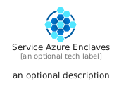
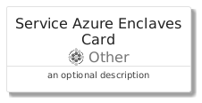
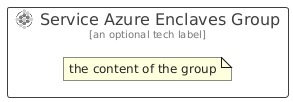

# ServiceAzureEnclaves


```text
azure/Item/Other/ServiceAzureEnclaves
```

```text
include('azure/Item/Other/ServiceAzureEnclaves')
```


| Illustration | ServiceAzureEnclaves | ServiceAzureEnclavesCard | ServiceAzureEnclavesGroup |
| :---: | :---: | :---: | :---: |
|  |  |  |  |


## Sprites
The item provides the following sriptes:

- `<$ServiceAzureEnclavesXs>`
- `<$ServiceAzureEnclavesSm>`
- `<$ServiceAzureEnclavesMd>`
- `<$ServiceAzureEnclavesLg>`


## ServiceAzureEnclaves

### Load remotely
```plantuml
@startuml
' configures the library
!global $LIB_BASE_LOCATION="https://raw.githubusercontent.com/tmorin/plantuml-libs/master/distribution"

' loads the library's bootstrap
!include $LIB_BASE_LOCATION/bootstrap.puml

' loads the package bootstrap
include('azure/bootstrap')

' loads the Item which embeds the element ServiceAzureEnclaves
include('azure/Item/Other/ServiceAzureEnclaves')

' renders the element
ServiceAzureEnclaves('ServiceAzureEnclaves', 'Service Azure Enclaves', 'an optional tech label', 'an optional description')
@enduml
```

### Load locally
```plantuml
@startuml
' configures the library
!global $INCLUSION_MODE="local"
!global $LIB_BASE_LOCATION="../../.."

' loads the library's bootstrap
!include $LIB_BASE_LOCATION/bootstrap.puml

' loads the package bootstrap
include('azure/bootstrap')

' loads the Item which embeds the element ServiceAzureEnclaves
include('azure/Item/Other/ServiceAzureEnclaves')

' renders the element
ServiceAzureEnclaves('ServiceAzureEnclaves', 'Service Azure Enclaves', 'an optional tech label', 'an optional description')
@enduml
```

## ServiceAzureEnclavesCard

### Load remotely
```plantuml
@startuml
' configures the library
!global $LIB_BASE_LOCATION="https://raw.githubusercontent.com/tmorin/plantuml-libs/master/distribution"

' loads the library's bootstrap
!include $LIB_BASE_LOCATION/bootstrap.puml

' loads the package bootstrap
include('azure/bootstrap')

' loads the Item which embeds the element ServiceAzureEnclavesCard
include('azure/Item/Other/ServiceAzureEnclaves')

' renders the element
ServiceAzureEnclavesCard('ServiceAzureEnclavesCard', 'Service Azure Enclaves Card', 'an optional description')
@enduml
```

### Load locally
```plantuml
@startuml
' configures the library
!global $INCLUSION_MODE="local"
!global $LIB_BASE_LOCATION="../../.."

' loads the library's bootstrap
!include $LIB_BASE_LOCATION/bootstrap.puml

' loads the package bootstrap
include('azure/bootstrap')

' loads the Item which embeds the element ServiceAzureEnclavesCard
include('azure/Item/Other/ServiceAzureEnclaves')

' renders the element
ServiceAzureEnclavesCard('ServiceAzureEnclavesCard', 'Service Azure Enclaves Card', 'an optional description')
@enduml
```

## ServiceAzureEnclavesGroup

### Load remotely
```plantuml
@startuml
' configures the library
!global $LIB_BASE_LOCATION="https://raw.githubusercontent.com/tmorin/plantuml-libs/master/distribution"

' loads the library's bootstrap
!include $LIB_BASE_LOCATION/bootstrap.puml

' loads the package bootstrap
include('azure/bootstrap')

' loads the Item which embeds the element ServiceAzureEnclavesGroup
include('azure/Item/Other/ServiceAzureEnclaves')

' renders the element
ServiceAzureEnclavesGroup('ServiceAzureEnclavesGroup', 'Service Azure Enclaves Group', 'an optional tech label') {
    note as note
        the content of the group
    end note
}
@enduml
```

### Load locally
```plantuml
@startuml
' configures the library
!global $INCLUSION_MODE="local"
!global $LIB_BASE_LOCATION="../../.."

' loads the library's bootstrap
!include $LIB_BASE_LOCATION/bootstrap.puml

' loads the package bootstrap
include('azure/bootstrap')

' loads the Item which embeds the element ServiceAzureEnclavesGroup
include('azure/Item/Other/ServiceAzureEnclaves')

' renders the element
ServiceAzureEnclavesGroup('ServiceAzureEnclavesGroup', 'Service Azure Enclaves Group', 'an optional tech label') {
    note as note
        the content of the group
    end note
}
@enduml
```

