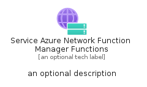
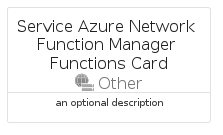
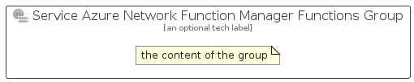

# ServiceAzureNetworkFunctionManagerFunctions


```text
azure/Item/Other/ServiceAzureNetworkFunctionManagerFunctions
```

```text
include('azure/Item/Other/ServiceAzureNetworkFunctionManagerFunctions')
```


| Illustration | ServiceAzureNetworkFunctionManagerFunctions | ServiceAzureNetworkFunctionManagerFunctionsCard | ServiceAzureNetworkFunctionManagerFunctionsGroup |
| :---: | :---: | :---: | :---: |
|  |  |  |  |


## Sprites
The item provides the following sriptes:

- `<$ServiceAzureNetworkFunctionManagerFunctionsXs>`
- `<$ServiceAzureNetworkFunctionManagerFunctionsSm>`
- `<$ServiceAzureNetworkFunctionManagerFunctionsMd>`
- `<$ServiceAzureNetworkFunctionManagerFunctionsLg>`


## ServiceAzureNetworkFunctionManagerFunctions

### Load remotely
```plantuml
@startuml
' configures the library
!global $LIB_BASE_LOCATION="https://raw.githubusercontent.com/tmorin/plantuml-libs/master/distribution"

' loads the library's bootstrap
!include $LIB_BASE_LOCATION/bootstrap.puml

' loads the package bootstrap
include('azure/bootstrap')

' loads the Item which embeds the element ServiceAzureNetworkFunctionManagerFunctions
include('azure/Item/Other/ServiceAzureNetworkFunctionManagerFunctions')

' renders the element
ServiceAzureNetworkFunctionManagerFunctions('ServiceAzureNetworkFunctionManagerFunctions', 'Service Azure Network Function Manager Functions', 'an optional tech label', 'an optional description')
@enduml
```

### Load locally
```plantuml
@startuml
' configures the library
!global $INCLUSION_MODE="local"
!global $LIB_BASE_LOCATION="../../.."

' loads the library's bootstrap
!include $LIB_BASE_LOCATION/bootstrap.puml

' loads the package bootstrap
include('azure/bootstrap')

' loads the Item which embeds the element ServiceAzureNetworkFunctionManagerFunctions
include('azure/Item/Other/ServiceAzureNetworkFunctionManagerFunctions')

' renders the element
ServiceAzureNetworkFunctionManagerFunctions('ServiceAzureNetworkFunctionManagerFunctions', 'Service Azure Network Function Manager Functions', 'an optional tech label', 'an optional description')
@enduml
```

## ServiceAzureNetworkFunctionManagerFunctionsCard

### Load remotely
```plantuml
@startuml
' configures the library
!global $LIB_BASE_LOCATION="https://raw.githubusercontent.com/tmorin/plantuml-libs/master/distribution"

' loads the library's bootstrap
!include $LIB_BASE_LOCATION/bootstrap.puml

' loads the package bootstrap
include('azure/bootstrap')

' loads the Item which embeds the element ServiceAzureNetworkFunctionManagerFunctionsCard
include('azure/Item/Other/ServiceAzureNetworkFunctionManagerFunctions')

' renders the element
ServiceAzureNetworkFunctionManagerFunctionsCard('ServiceAzureNetworkFunctionManagerFunctionsCard', 'Service Azure Network Function Manager Functions Card', 'an optional description')
@enduml
```

### Load locally
```plantuml
@startuml
' configures the library
!global $INCLUSION_MODE="local"
!global $LIB_BASE_LOCATION="../../.."

' loads the library's bootstrap
!include $LIB_BASE_LOCATION/bootstrap.puml

' loads the package bootstrap
include('azure/bootstrap')

' loads the Item which embeds the element ServiceAzureNetworkFunctionManagerFunctionsCard
include('azure/Item/Other/ServiceAzureNetworkFunctionManagerFunctions')

' renders the element
ServiceAzureNetworkFunctionManagerFunctionsCard('ServiceAzureNetworkFunctionManagerFunctionsCard', 'Service Azure Network Function Manager Functions Card', 'an optional description')
@enduml
```

## ServiceAzureNetworkFunctionManagerFunctionsGroup

### Load remotely
```plantuml
@startuml
' configures the library
!global $LIB_BASE_LOCATION="https://raw.githubusercontent.com/tmorin/plantuml-libs/master/distribution"

' loads the library's bootstrap
!include $LIB_BASE_LOCATION/bootstrap.puml

' loads the package bootstrap
include('azure/bootstrap')

' loads the Item which embeds the element ServiceAzureNetworkFunctionManagerFunctionsGroup
include('azure/Item/Other/ServiceAzureNetworkFunctionManagerFunctions')

' renders the element
ServiceAzureNetworkFunctionManagerFunctionsGroup('ServiceAzureNetworkFunctionManagerFunctionsGroup', 'Service Azure Network Function Manager Functions Group', 'an optional tech label') {
    note as note
        the content of the group
    end note
}
@enduml
```

### Load locally
```plantuml
@startuml
' configures the library
!global $INCLUSION_MODE="local"
!global $LIB_BASE_LOCATION="../../.."

' loads the library's bootstrap
!include $LIB_BASE_LOCATION/bootstrap.puml

' loads the package bootstrap
include('azure/bootstrap')

' loads the Item which embeds the element ServiceAzureNetworkFunctionManagerFunctionsGroup
include('azure/Item/Other/ServiceAzureNetworkFunctionManagerFunctions')

' renders the element
ServiceAzureNetworkFunctionManagerFunctionsGroup('ServiceAzureNetworkFunctionManagerFunctionsGroup', 'Service Azure Network Function Manager Functions Group', 'an optional tech label') {
    note as note
        the content of the group
    end note
}
@enduml
```

