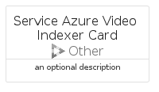
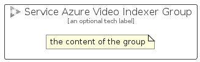

# ServiceAzureVideoIndexer


```text
azure/Item/Other/ServiceAzureVideoIndexer
```

```text
include('azure/Item/Other/ServiceAzureVideoIndexer')
```


| Illustration | ServiceAzureVideoIndexer | ServiceAzureVideoIndexerCard | ServiceAzureVideoIndexerGroup |
| :---: | :---: | :---: | :---: |
|  |  |  |  |


## Sprites
The item provides the following sriptes:

- `<$ServiceAzureVideoIndexerXs>`
- `<$ServiceAzureVideoIndexerSm>`
- `<$ServiceAzureVideoIndexerMd>`
- `<$ServiceAzureVideoIndexerLg>`


## ServiceAzureVideoIndexer

### Load remotely
```plantuml
@startuml
' configures the library
!global $LIB_BASE_LOCATION="https://raw.githubusercontent.com/tmorin/plantuml-libs/master/distribution"

' loads the library's bootstrap
!include $LIB_BASE_LOCATION/bootstrap.puml

' loads the package bootstrap
include('azure/bootstrap')

' loads the Item which embeds the element ServiceAzureVideoIndexer
include('azure/Item/Other/ServiceAzureVideoIndexer')

' renders the element
ServiceAzureVideoIndexer('ServiceAzureVideoIndexer', 'Service Azure Video Indexer', 'an optional tech label', 'an optional description')
@enduml
```

### Load locally
```plantuml
@startuml
' configures the library
!global $INCLUSION_MODE="local"
!global $LIB_BASE_LOCATION="../../.."

' loads the library's bootstrap
!include $LIB_BASE_LOCATION/bootstrap.puml

' loads the package bootstrap
include('azure/bootstrap')

' loads the Item which embeds the element ServiceAzureVideoIndexer
include('azure/Item/Other/ServiceAzureVideoIndexer')

' renders the element
ServiceAzureVideoIndexer('ServiceAzureVideoIndexer', 'Service Azure Video Indexer', 'an optional tech label', 'an optional description')
@enduml
```

## ServiceAzureVideoIndexerCard

### Load remotely
```plantuml
@startuml
' configures the library
!global $LIB_BASE_LOCATION="https://raw.githubusercontent.com/tmorin/plantuml-libs/master/distribution"

' loads the library's bootstrap
!include $LIB_BASE_LOCATION/bootstrap.puml

' loads the package bootstrap
include('azure/bootstrap')

' loads the Item which embeds the element ServiceAzureVideoIndexerCard
include('azure/Item/Other/ServiceAzureVideoIndexer')

' renders the element
ServiceAzureVideoIndexerCard('ServiceAzureVideoIndexerCard', 'Service Azure Video Indexer Card', 'an optional description')
@enduml
```

### Load locally
```plantuml
@startuml
' configures the library
!global $INCLUSION_MODE="local"
!global $LIB_BASE_LOCATION="../../.."

' loads the library's bootstrap
!include $LIB_BASE_LOCATION/bootstrap.puml

' loads the package bootstrap
include('azure/bootstrap')

' loads the Item which embeds the element ServiceAzureVideoIndexerCard
include('azure/Item/Other/ServiceAzureVideoIndexer')

' renders the element
ServiceAzureVideoIndexerCard('ServiceAzureVideoIndexerCard', 'Service Azure Video Indexer Card', 'an optional description')
@enduml
```

## ServiceAzureVideoIndexerGroup

### Load remotely
```plantuml
@startuml
' configures the library
!global $LIB_BASE_LOCATION="https://raw.githubusercontent.com/tmorin/plantuml-libs/master/distribution"

' loads the library's bootstrap
!include $LIB_BASE_LOCATION/bootstrap.puml

' loads the package bootstrap
include('azure/bootstrap')

' loads the Item which embeds the element ServiceAzureVideoIndexerGroup
include('azure/Item/Other/ServiceAzureVideoIndexer')

' renders the element
ServiceAzureVideoIndexerGroup('ServiceAzureVideoIndexerGroup', 'Service Azure Video Indexer Group', 'an optional tech label') {
    note as note
        the content of the group
    end note
}
@enduml
```

### Load locally
```plantuml
@startuml
' configures the library
!global $INCLUSION_MODE="local"
!global $LIB_BASE_LOCATION="../../.."

' loads the library's bootstrap
!include $LIB_BASE_LOCATION/bootstrap.puml

' loads the package bootstrap
include('azure/bootstrap')

' loads the Item which embeds the element ServiceAzureVideoIndexerGroup
include('azure/Item/Other/ServiceAzureVideoIndexer')

' renders the element
ServiceAzureVideoIndexerGroup('ServiceAzureVideoIndexerGroup', 'Service Azure Video Indexer Group', 'an optional tech label') {
    note as note
        the content of the group
    end note
}
@enduml
```

