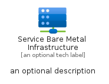
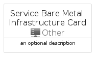
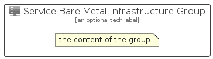

# ServiceBareMetalInfrastructure


```text
azure/Item/Other/ServiceBareMetalInfrastructure
```

```text
include('azure/Item/Other/ServiceBareMetalInfrastructure')
```


| Illustration | ServiceBareMetalInfrastructure | ServiceBareMetalInfrastructureCard | ServiceBareMetalInfrastructureGroup |
| :---: | :---: | :---: | :---: |
|  |  |  |  |


## Sprites
The item provides the following sriptes:

- `<$ServiceBareMetalInfrastructureXs>`
- `<$ServiceBareMetalInfrastructureSm>`
- `<$ServiceBareMetalInfrastructureMd>`
- `<$ServiceBareMetalInfrastructureLg>`


## ServiceBareMetalInfrastructure

### Load remotely
```plantuml
@startuml
' configures the library
!global $LIB_BASE_LOCATION="https://raw.githubusercontent.com/tmorin/plantuml-libs/master/distribution"

' loads the library's bootstrap
!include $LIB_BASE_LOCATION/bootstrap.puml

' loads the package bootstrap
include('azure/bootstrap')

' loads the Item which embeds the element ServiceBareMetalInfrastructure
include('azure/Item/Other/ServiceBareMetalInfrastructure')

' renders the element
ServiceBareMetalInfrastructure('ServiceBareMetalInfrastructure', 'Service Bare Metal Infrastructure', 'an optional tech label', 'an optional description')
@enduml
```

### Load locally
```plantuml
@startuml
' configures the library
!global $INCLUSION_MODE="local"
!global $LIB_BASE_LOCATION="../../.."

' loads the library's bootstrap
!include $LIB_BASE_LOCATION/bootstrap.puml

' loads the package bootstrap
include('azure/bootstrap')

' loads the Item which embeds the element ServiceBareMetalInfrastructure
include('azure/Item/Other/ServiceBareMetalInfrastructure')

' renders the element
ServiceBareMetalInfrastructure('ServiceBareMetalInfrastructure', 'Service Bare Metal Infrastructure', 'an optional tech label', 'an optional description')
@enduml
```

## ServiceBareMetalInfrastructureCard

### Load remotely
```plantuml
@startuml
' configures the library
!global $LIB_BASE_LOCATION="https://raw.githubusercontent.com/tmorin/plantuml-libs/master/distribution"

' loads the library's bootstrap
!include $LIB_BASE_LOCATION/bootstrap.puml

' loads the package bootstrap
include('azure/bootstrap')

' loads the Item which embeds the element ServiceBareMetalInfrastructureCard
include('azure/Item/Other/ServiceBareMetalInfrastructure')

' renders the element
ServiceBareMetalInfrastructureCard('ServiceBareMetalInfrastructureCard', 'Service Bare Metal Infrastructure Card', 'an optional description')
@enduml
```

### Load locally
```plantuml
@startuml
' configures the library
!global $INCLUSION_MODE="local"
!global $LIB_BASE_LOCATION="../../.."

' loads the library's bootstrap
!include $LIB_BASE_LOCATION/bootstrap.puml

' loads the package bootstrap
include('azure/bootstrap')

' loads the Item which embeds the element ServiceBareMetalInfrastructureCard
include('azure/Item/Other/ServiceBareMetalInfrastructure')

' renders the element
ServiceBareMetalInfrastructureCard('ServiceBareMetalInfrastructureCard', 'Service Bare Metal Infrastructure Card', 'an optional description')
@enduml
```

## ServiceBareMetalInfrastructureGroup

### Load remotely
```plantuml
@startuml
' configures the library
!global $LIB_BASE_LOCATION="https://raw.githubusercontent.com/tmorin/plantuml-libs/master/distribution"

' loads the library's bootstrap
!include $LIB_BASE_LOCATION/bootstrap.puml

' loads the package bootstrap
include('azure/bootstrap')

' loads the Item which embeds the element ServiceBareMetalInfrastructureGroup
include('azure/Item/Other/ServiceBareMetalInfrastructure')

' renders the element
ServiceBareMetalInfrastructureGroup('ServiceBareMetalInfrastructureGroup', 'Service Bare Metal Infrastructure Group', 'an optional tech label') {
    note as note
        the content of the group
    end note
}
@enduml
```

### Load locally
```plantuml
@startuml
' configures the library
!global $INCLUSION_MODE="local"
!global $LIB_BASE_LOCATION="../../.."

' loads the library's bootstrap
!include $LIB_BASE_LOCATION/bootstrap.puml

' loads the package bootstrap
include('azure/bootstrap')

' loads the Item which embeds the element ServiceBareMetalInfrastructureGroup
include('azure/Item/Other/ServiceBareMetalInfrastructure')

' renders the element
ServiceBareMetalInfrastructureGroup('ServiceBareMetalInfrastructureGroup', 'Service Bare Metal Infrastructure Group', 'an optional tech label') {
    note as note
        the content of the group
    end note
}
@enduml
```

