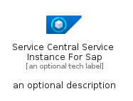
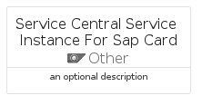
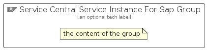

# ServiceCentralServiceInstanceForSap


```text
azure/Item/Other/ServiceCentralServiceInstanceForSap
```

```text
include('azure/Item/Other/ServiceCentralServiceInstanceForSap')
```


| Illustration | ServiceCentralServiceInstanceForSap | ServiceCentralServiceInstanceForSapCard | ServiceCentralServiceInstanceForSapGroup |
| :---: | :---: | :---: | :---: |
|  |  |  |  |


## Sprites
The item provides the following sriptes:

- `<$ServiceCentralServiceInstanceForSapXs>`
- `<$ServiceCentralServiceInstanceForSapSm>`
- `<$ServiceCentralServiceInstanceForSapMd>`
- `<$ServiceCentralServiceInstanceForSapLg>`


## ServiceCentralServiceInstanceForSap

### Load remotely
```plantuml
@startuml
' configures the library
!global $LIB_BASE_LOCATION="https://raw.githubusercontent.com/tmorin/plantuml-libs/master/distribution"

' loads the library's bootstrap
!include $LIB_BASE_LOCATION/bootstrap.puml

' loads the package bootstrap
include('azure/bootstrap')

' loads the Item which embeds the element ServiceCentralServiceInstanceForSap
include('azure/Item/Other/ServiceCentralServiceInstanceForSap')

' renders the element
ServiceCentralServiceInstanceForSap('ServiceCentralServiceInstanceForSap', 'Service Central Service Instance For Sap', 'an optional tech label', 'an optional description')
@enduml
```

### Load locally
```plantuml
@startuml
' configures the library
!global $INCLUSION_MODE="local"
!global $LIB_BASE_LOCATION="../../.."

' loads the library's bootstrap
!include $LIB_BASE_LOCATION/bootstrap.puml

' loads the package bootstrap
include('azure/bootstrap')

' loads the Item which embeds the element ServiceCentralServiceInstanceForSap
include('azure/Item/Other/ServiceCentralServiceInstanceForSap')

' renders the element
ServiceCentralServiceInstanceForSap('ServiceCentralServiceInstanceForSap', 'Service Central Service Instance For Sap', 'an optional tech label', 'an optional description')
@enduml
```

## ServiceCentralServiceInstanceForSapCard

### Load remotely
```plantuml
@startuml
' configures the library
!global $LIB_BASE_LOCATION="https://raw.githubusercontent.com/tmorin/plantuml-libs/master/distribution"

' loads the library's bootstrap
!include $LIB_BASE_LOCATION/bootstrap.puml

' loads the package bootstrap
include('azure/bootstrap')

' loads the Item which embeds the element ServiceCentralServiceInstanceForSapCard
include('azure/Item/Other/ServiceCentralServiceInstanceForSap')

' renders the element
ServiceCentralServiceInstanceForSapCard('ServiceCentralServiceInstanceForSapCard', 'Service Central Service Instance For Sap Card', 'an optional description')
@enduml
```

### Load locally
```plantuml
@startuml
' configures the library
!global $INCLUSION_MODE="local"
!global $LIB_BASE_LOCATION="../../.."

' loads the library's bootstrap
!include $LIB_BASE_LOCATION/bootstrap.puml

' loads the package bootstrap
include('azure/bootstrap')

' loads the Item which embeds the element ServiceCentralServiceInstanceForSapCard
include('azure/Item/Other/ServiceCentralServiceInstanceForSap')

' renders the element
ServiceCentralServiceInstanceForSapCard('ServiceCentralServiceInstanceForSapCard', 'Service Central Service Instance For Sap Card', 'an optional description')
@enduml
```

## ServiceCentralServiceInstanceForSapGroup

### Load remotely
```plantuml
@startuml
' configures the library
!global $LIB_BASE_LOCATION="https://raw.githubusercontent.com/tmorin/plantuml-libs/master/distribution"

' loads the library's bootstrap
!include $LIB_BASE_LOCATION/bootstrap.puml

' loads the package bootstrap
include('azure/bootstrap')

' loads the Item which embeds the element ServiceCentralServiceInstanceForSapGroup
include('azure/Item/Other/ServiceCentralServiceInstanceForSap')

' renders the element
ServiceCentralServiceInstanceForSapGroup('ServiceCentralServiceInstanceForSapGroup', 'Service Central Service Instance For Sap Group', 'an optional tech label') {
    note as note
        the content of the group
    end note
}
@enduml
```

### Load locally
```plantuml
@startuml
' configures the library
!global $INCLUSION_MODE="local"
!global $LIB_BASE_LOCATION="../../.."

' loads the library's bootstrap
!include $LIB_BASE_LOCATION/bootstrap.puml

' loads the package bootstrap
include('azure/bootstrap')

' loads the Item which embeds the element ServiceCentralServiceInstanceForSapGroup
include('azure/Item/Other/ServiceCentralServiceInstanceForSap')

' renders the element
ServiceCentralServiceInstanceForSapGroup('ServiceCentralServiceInstanceForSapGroup', 'Service Central Service Instance For Sap Group', 'an optional tech label') {
    note as note
        the content of the group
    end note
}
@enduml
```

