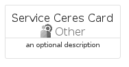
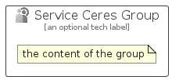

# ServiceCeres


```text
azure/Item/Other/ServiceCeres
```

```text
include('azure/Item/Other/ServiceCeres')
```


| Illustration | ServiceCeres | ServiceCeresCard | ServiceCeresGroup |
| :---: | :---: | :---: | :---: |
|  |  |  |  |


## Sprites
The item provides the following sriptes:

- `<$ServiceCeresXs>`
- `<$ServiceCeresSm>`
- `<$ServiceCeresMd>`
- `<$ServiceCeresLg>`


## ServiceCeres

### Load remotely
```plantuml
@startuml
' configures the library
!global $LIB_BASE_LOCATION="https://raw.githubusercontent.com/tmorin/plantuml-libs/master/distribution"

' loads the library's bootstrap
!include $LIB_BASE_LOCATION/bootstrap.puml

' loads the package bootstrap
include('azure/bootstrap')

' loads the Item which embeds the element ServiceCeres
include('azure/Item/Other/ServiceCeres')

' renders the element
ServiceCeres('ServiceCeres', 'Service Ceres', 'an optional tech label', 'an optional description')
@enduml
```

### Load locally
```plantuml
@startuml
' configures the library
!global $INCLUSION_MODE="local"
!global $LIB_BASE_LOCATION="../../.."

' loads the library's bootstrap
!include $LIB_BASE_LOCATION/bootstrap.puml

' loads the package bootstrap
include('azure/bootstrap')

' loads the Item which embeds the element ServiceCeres
include('azure/Item/Other/ServiceCeres')

' renders the element
ServiceCeres('ServiceCeres', 'Service Ceres', 'an optional tech label', 'an optional description')
@enduml
```

## ServiceCeresCard

### Load remotely
```plantuml
@startuml
' configures the library
!global $LIB_BASE_LOCATION="https://raw.githubusercontent.com/tmorin/plantuml-libs/master/distribution"

' loads the library's bootstrap
!include $LIB_BASE_LOCATION/bootstrap.puml

' loads the package bootstrap
include('azure/bootstrap')

' loads the Item which embeds the element ServiceCeresCard
include('azure/Item/Other/ServiceCeres')

' renders the element
ServiceCeresCard('ServiceCeresCard', 'Service Ceres Card', 'an optional description')
@enduml
```

### Load locally
```plantuml
@startuml
' configures the library
!global $INCLUSION_MODE="local"
!global $LIB_BASE_LOCATION="../../.."

' loads the library's bootstrap
!include $LIB_BASE_LOCATION/bootstrap.puml

' loads the package bootstrap
include('azure/bootstrap')

' loads the Item which embeds the element ServiceCeresCard
include('azure/Item/Other/ServiceCeres')

' renders the element
ServiceCeresCard('ServiceCeresCard', 'Service Ceres Card', 'an optional description')
@enduml
```

## ServiceCeresGroup

### Load remotely
```plantuml
@startuml
' configures the library
!global $LIB_BASE_LOCATION="https://raw.githubusercontent.com/tmorin/plantuml-libs/master/distribution"

' loads the library's bootstrap
!include $LIB_BASE_LOCATION/bootstrap.puml

' loads the package bootstrap
include('azure/bootstrap')

' loads the Item which embeds the element ServiceCeresGroup
include('azure/Item/Other/ServiceCeres')

' renders the element
ServiceCeresGroup('ServiceCeresGroup', 'Service Ceres Group', 'an optional tech label') {
    note as note
        the content of the group
    end note
}
@enduml
```

### Load locally
```plantuml
@startuml
' configures the library
!global $INCLUSION_MODE="local"
!global $LIB_BASE_LOCATION="../../.."

' loads the library's bootstrap
!include $LIB_BASE_LOCATION/bootstrap.puml

' loads the package bootstrap
include('azure/bootstrap')

' loads the Item which embeds the element ServiceCeresGroup
include('azure/Item/Other/ServiceCeres')

' renders the element
ServiceCeresGroup('ServiceCeresGroup', 'Service Ceres Group', 'an optional tech label') {
    note as note
        the content of the group
    end note
}
@enduml
```

