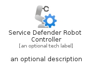
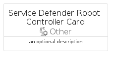
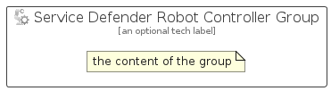

# ServiceDefenderRobotController


```text
azure/Item/Other/ServiceDefenderRobotController
```

```text
include('azure/Item/Other/ServiceDefenderRobotController')
```


| Illustration | ServiceDefenderRobotController | ServiceDefenderRobotControllerCard | ServiceDefenderRobotControllerGroup |
| :---: | :---: | :---: | :---: |
|  |  |  |  |


## Sprites
The item provides the following sriptes:

- `<$ServiceDefenderRobotControllerXs>`
- `<$ServiceDefenderRobotControllerSm>`
- `<$ServiceDefenderRobotControllerMd>`
- `<$ServiceDefenderRobotControllerLg>`


## ServiceDefenderRobotController

### Load remotely
```plantuml
@startuml
' configures the library
!global $LIB_BASE_LOCATION="https://raw.githubusercontent.com/tmorin/plantuml-libs/master/distribution"

' loads the library's bootstrap
!include $LIB_BASE_LOCATION/bootstrap.puml

' loads the package bootstrap
include('azure/bootstrap')

' loads the Item which embeds the element ServiceDefenderRobotController
include('azure/Item/Other/ServiceDefenderRobotController')

' renders the element
ServiceDefenderRobotController('ServiceDefenderRobotController', 'Service Defender Robot Controller', 'an optional tech label', 'an optional description')
@enduml
```

### Load locally
```plantuml
@startuml
' configures the library
!global $INCLUSION_MODE="local"
!global $LIB_BASE_LOCATION="../../.."

' loads the library's bootstrap
!include $LIB_BASE_LOCATION/bootstrap.puml

' loads the package bootstrap
include('azure/bootstrap')

' loads the Item which embeds the element ServiceDefenderRobotController
include('azure/Item/Other/ServiceDefenderRobotController')

' renders the element
ServiceDefenderRobotController('ServiceDefenderRobotController', 'Service Defender Robot Controller', 'an optional tech label', 'an optional description')
@enduml
```

## ServiceDefenderRobotControllerCard

### Load remotely
```plantuml
@startuml
' configures the library
!global $LIB_BASE_LOCATION="https://raw.githubusercontent.com/tmorin/plantuml-libs/master/distribution"

' loads the library's bootstrap
!include $LIB_BASE_LOCATION/bootstrap.puml

' loads the package bootstrap
include('azure/bootstrap')

' loads the Item which embeds the element ServiceDefenderRobotControllerCard
include('azure/Item/Other/ServiceDefenderRobotController')

' renders the element
ServiceDefenderRobotControllerCard('ServiceDefenderRobotControllerCard', 'Service Defender Robot Controller Card', 'an optional description')
@enduml
```

### Load locally
```plantuml
@startuml
' configures the library
!global $INCLUSION_MODE="local"
!global $LIB_BASE_LOCATION="../../.."

' loads the library's bootstrap
!include $LIB_BASE_LOCATION/bootstrap.puml

' loads the package bootstrap
include('azure/bootstrap')

' loads the Item which embeds the element ServiceDefenderRobotControllerCard
include('azure/Item/Other/ServiceDefenderRobotController')

' renders the element
ServiceDefenderRobotControllerCard('ServiceDefenderRobotControllerCard', 'Service Defender Robot Controller Card', 'an optional description')
@enduml
```

## ServiceDefenderRobotControllerGroup

### Load remotely
```plantuml
@startuml
' configures the library
!global $LIB_BASE_LOCATION="https://raw.githubusercontent.com/tmorin/plantuml-libs/master/distribution"

' loads the library's bootstrap
!include $LIB_BASE_LOCATION/bootstrap.puml

' loads the package bootstrap
include('azure/bootstrap')

' loads the Item which embeds the element ServiceDefenderRobotControllerGroup
include('azure/Item/Other/ServiceDefenderRobotController')

' renders the element
ServiceDefenderRobotControllerGroup('ServiceDefenderRobotControllerGroup', 'Service Defender Robot Controller Group', 'an optional tech label') {
    note as note
        the content of the group
    end note
}
@enduml
```

### Load locally
```plantuml
@startuml
' configures the library
!global $INCLUSION_MODE="local"
!global $LIB_BASE_LOCATION="../../.."

' loads the library's bootstrap
!include $LIB_BASE_LOCATION/bootstrap.puml

' loads the package bootstrap
include('azure/bootstrap')

' loads the Item which embeds the element ServiceDefenderRobotControllerGroup
include('azure/Item/Other/ServiceDefenderRobotController')

' renders the element
ServiceDefenderRobotControllerGroup('ServiceDefenderRobotControllerGroup', 'Service Defender Robot Controller Group', 'an optional tech label') {
    note as note
        the content of the group
    end note
}
@enduml
```

