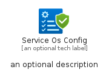
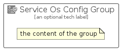

# ServiceOsConfig


```text
azure/Item/Other/ServiceOsConfig
```

```text
include('azure/Item/Other/ServiceOsConfig')
```


| Illustration | ServiceOsConfig | ServiceOsConfigCard | ServiceOsConfigGroup |
| :---: | :---: | :---: | :---: |
|  |  |  |  |


## Sprites
The item provides the following sriptes:

- `<$ServiceOsConfigXs>`
- `<$ServiceOsConfigSm>`
- `<$ServiceOsConfigMd>`
- `<$ServiceOsConfigLg>`


## ServiceOsConfig

### Load remotely
```plantuml
@startuml
' configures the library
!global $LIB_BASE_LOCATION="https://raw.githubusercontent.com/tmorin/plantuml-libs/master/distribution"

' loads the library's bootstrap
!include $LIB_BASE_LOCATION/bootstrap.puml

' loads the package bootstrap
include('azure/bootstrap')

' loads the Item which embeds the element ServiceOsConfig
include('azure/Item/Other/ServiceOsConfig')

' renders the element
ServiceOsConfig('ServiceOsConfig', 'Service Os Config', 'an optional tech label', 'an optional description')
@enduml
```

### Load locally
```plantuml
@startuml
' configures the library
!global $INCLUSION_MODE="local"
!global $LIB_BASE_LOCATION="../../.."

' loads the library's bootstrap
!include $LIB_BASE_LOCATION/bootstrap.puml

' loads the package bootstrap
include('azure/bootstrap')

' loads the Item which embeds the element ServiceOsConfig
include('azure/Item/Other/ServiceOsConfig')

' renders the element
ServiceOsConfig('ServiceOsConfig', 'Service Os Config', 'an optional tech label', 'an optional description')
@enduml
```

## ServiceOsConfigCard

### Load remotely
```plantuml
@startuml
' configures the library
!global $LIB_BASE_LOCATION="https://raw.githubusercontent.com/tmorin/plantuml-libs/master/distribution"

' loads the library's bootstrap
!include $LIB_BASE_LOCATION/bootstrap.puml

' loads the package bootstrap
include('azure/bootstrap')

' loads the Item which embeds the element ServiceOsConfigCard
include('azure/Item/Other/ServiceOsConfig')

' renders the element
ServiceOsConfigCard('ServiceOsConfigCard', 'Service Os Config Card', 'an optional description')
@enduml
```

### Load locally
```plantuml
@startuml
' configures the library
!global $INCLUSION_MODE="local"
!global $LIB_BASE_LOCATION="../../.."

' loads the library's bootstrap
!include $LIB_BASE_LOCATION/bootstrap.puml

' loads the package bootstrap
include('azure/bootstrap')

' loads the Item which embeds the element ServiceOsConfigCard
include('azure/Item/Other/ServiceOsConfig')

' renders the element
ServiceOsConfigCard('ServiceOsConfigCard', 'Service Os Config Card', 'an optional description')
@enduml
```

## ServiceOsConfigGroup

### Load remotely
```plantuml
@startuml
' configures the library
!global $LIB_BASE_LOCATION="https://raw.githubusercontent.com/tmorin/plantuml-libs/master/distribution"

' loads the library's bootstrap
!include $LIB_BASE_LOCATION/bootstrap.puml

' loads the package bootstrap
include('azure/bootstrap')

' loads the Item which embeds the element ServiceOsConfigGroup
include('azure/Item/Other/ServiceOsConfig')

' renders the element
ServiceOsConfigGroup('ServiceOsConfigGroup', 'Service Os Config Group', 'an optional tech label') {
    note as note
        the content of the group
    end note
}
@enduml
```

### Load locally
```plantuml
@startuml
' configures the library
!global $INCLUSION_MODE="local"
!global $LIB_BASE_LOCATION="../../.."

' loads the library's bootstrap
!include $LIB_BASE_LOCATION/bootstrap.puml

' loads the package bootstrap
include('azure/bootstrap')

' loads the Item which embeds the element ServiceOsConfigGroup
include('azure/Item/Other/ServiceOsConfig')

' renders the element
ServiceOsConfigGroup('ServiceOsConfigGroup', 'Service Os Config Group', 'an optional tech label') {
    note as note
        the content of the group
    end note
}
@enduml
```

