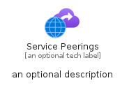
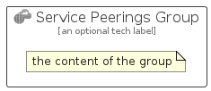

# ServicePeerings


```text
azure/Item/Other/ServicePeerings
```

```text
include('azure/Item/Other/ServicePeerings')
```


| Illustration | ServicePeerings | ServicePeeringsCard | ServicePeeringsGroup |
| :---: | :---: | :---: | :---: |
|  |  |  |  |


## Sprites
The item provides the following sriptes:

- `<$ServicePeeringsXs>`
- `<$ServicePeeringsSm>`
- `<$ServicePeeringsMd>`
- `<$ServicePeeringsLg>`


## ServicePeerings

### Load remotely
```plantuml
@startuml
' configures the library
!global $LIB_BASE_LOCATION="https://raw.githubusercontent.com/tmorin/plantuml-libs/master/distribution"

' loads the library's bootstrap
!include $LIB_BASE_LOCATION/bootstrap.puml

' loads the package bootstrap
include('azure/bootstrap')

' loads the Item which embeds the element ServicePeerings
include('azure/Item/Other/ServicePeerings')

' renders the element
ServicePeerings('ServicePeerings', 'Service Peerings', 'an optional tech label', 'an optional description')
@enduml
```

### Load locally
```plantuml
@startuml
' configures the library
!global $INCLUSION_MODE="local"
!global $LIB_BASE_LOCATION="../../.."

' loads the library's bootstrap
!include $LIB_BASE_LOCATION/bootstrap.puml

' loads the package bootstrap
include('azure/bootstrap')

' loads the Item which embeds the element ServicePeerings
include('azure/Item/Other/ServicePeerings')

' renders the element
ServicePeerings('ServicePeerings', 'Service Peerings', 'an optional tech label', 'an optional description')
@enduml
```

## ServicePeeringsCard

### Load remotely
```plantuml
@startuml
' configures the library
!global $LIB_BASE_LOCATION="https://raw.githubusercontent.com/tmorin/plantuml-libs/master/distribution"

' loads the library's bootstrap
!include $LIB_BASE_LOCATION/bootstrap.puml

' loads the package bootstrap
include('azure/bootstrap')

' loads the Item which embeds the element ServicePeeringsCard
include('azure/Item/Other/ServicePeerings')

' renders the element
ServicePeeringsCard('ServicePeeringsCard', 'Service Peerings Card', 'an optional description')
@enduml
```

### Load locally
```plantuml
@startuml
' configures the library
!global $INCLUSION_MODE="local"
!global $LIB_BASE_LOCATION="../../.."

' loads the library's bootstrap
!include $LIB_BASE_LOCATION/bootstrap.puml

' loads the package bootstrap
include('azure/bootstrap')

' loads the Item which embeds the element ServicePeeringsCard
include('azure/Item/Other/ServicePeerings')

' renders the element
ServicePeeringsCard('ServicePeeringsCard', 'Service Peerings Card', 'an optional description')
@enduml
```

## ServicePeeringsGroup

### Load remotely
```plantuml
@startuml
' configures the library
!global $LIB_BASE_LOCATION="https://raw.githubusercontent.com/tmorin/plantuml-libs/master/distribution"

' loads the library's bootstrap
!include $LIB_BASE_LOCATION/bootstrap.puml

' loads the package bootstrap
include('azure/bootstrap')

' loads the Item which embeds the element ServicePeeringsGroup
include('azure/Item/Other/ServicePeerings')

' renders the element
ServicePeeringsGroup('ServicePeeringsGroup', 'Service Peerings Group', 'an optional tech label') {
    note as note
        the content of the group
    end note
}
@enduml
```

### Load locally
```plantuml
@startuml
' configures the library
!global $INCLUSION_MODE="local"
!global $LIB_BASE_LOCATION="../../.."

' loads the library's bootstrap
!include $LIB_BASE_LOCATION/bootstrap.puml

' loads the package bootstrap
include('azure/bootstrap')

' loads the Item which embeds the element ServicePeeringsGroup
include('azure/Item/Other/ServicePeerings')

' renders the element
ServicePeeringsGroup('ServicePeeringsGroup', 'Service Peerings Group', 'an optional tech label') {
    note as note
        the content of the group
    end note
}
@enduml
```

