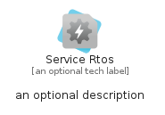
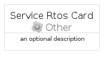
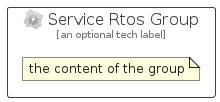

# ServiceRtos


```text
azure/Item/Other/ServiceRtos
```

```text
include('azure/Item/Other/ServiceRtos')
```


| Illustration | ServiceRtos | ServiceRtosCard | ServiceRtosGroup |
| :---: | :---: | :---: | :---: |
|  |  |  |  |


## Sprites
The item provides the following sriptes:

- `<$ServiceRtosXs>`
- `<$ServiceRtosSm>`
- `<$ServiceRtosMd>`
- `<$ServiceRtosLg>`


## ServiceRtos

### Load remotely
```plantuml
@startuml
' configures the library
!global $LIB_BASE_LOCATION="https://raw.githubusercontent.com/tmorin/plantuml-libs/master/distribution"

' loads the library's bootstrap
!include $LIB_BASE_LOCATION/bootstrap.puml

' loads the package bootstrap
include('azure/bootstrap')

' loads the Item which embeds the element ServiceRtos
include('azure/Item/Other/ServiceRtos')

' renders the element
ServiceRtos('ServiceRtos', 'Service Rtos', 'an optional tech label', 'an optional description')
@enduml
```

### Load locally
```plantuml
@startuml
' configures the library
!global $INCLUSION_MODE="local"
!global $LIB_BASE_LOCATION="../../.."

' loads the library's bootstrap
!include $LIB_BASE_LOCATION/bootstrap.puml

' loads the package bootstrap
include('azure/bootstrap')

' loads the Item which embeds the element ServiceRtos
include('azure/Item/Other/ServiceRtos')

' renders the element
ServiceRtos('ServiceRtos', 'Service Rtos', 'an optional tech label', 'an optional description')
@enduml
```

## ServiceRtosCard

### Load remotely
```plantuml
@startuml
' configures the library
!global $LIB_BASE_LOCATION="https://raw.githubusercontent.com/tmorin/plantuml-libs/master/distribution"

' loads the library's bootstrap
!include $LIB_BASE_LOCATION/bootstrap.puml

' loads the package bootstrap
include('azure/bootstrap')

' loads the Item which embeds the element ServiceRtosCard
include('azure/Item/Other/ServiceRtos')

' renders the element
ServiceRtosCard('ServiceRtosCard', 'Service Rtos Card', 'an optional description')
@enduml
```

### Load locally
```plantuml
@startuml
' configures the library
!global $INCLUSION_MODE="local"
!global $LIB_BASE_LOCATION="../../.."

' loads the library's bootstrap
!include $LIB_BASE_LOCATION/bootstrap.puml

' loads the package bootstrap
include('azure/bootstrap')

' loads the Item which embeds the element ServiceRtosCard
include('azure/Item/Other/ServiceRtos')

' renders the element
ServiceRtosCard('ServiceRtosCard', 'Service Rtos Card', 'an optional description')
@enduml
```

## ServiceRtosGroup

### Load remotely
```plantuml
@startuml
' configures the library
!global $LIB_BASE_LOCATION="https://raw.githubusercontent.com/tmorin/plantuml-libs/master/distribution"

' loads the library's bootstrap
!include $LIB_BASE_LOCATION/bootstrap.puml

' loads the package bootstrap
include('azure/bootstrap')

' loads the Item which embeds the element ServiceRtosGroup
include('azure/Item/Other/ServiceRtos')

' renders the element
ServiceRtosGroup('ServiceRtosGroup', 'Service Rtos Group', 'an optional tech label') {
    note as note
        the content of the group
    end note
}
@enduml
```

### Load locally
```plantuml
@startuml
' configures the library
!global $INCLUSION_MODE="local"
!global $LIB_BASE_LOCATION="../../.."

' loads the library's bootstrap
!include $LIB_BASE_LOCATION/bootstrap.puml

' loads the package bootstrap
include('azure/bootstrap')

' loads the Item which embeds the element ServiceRtosGroup
include('azure/Item/Other/ServiceRtos')

' renders the element
ServiceRtosGroup('ServiceRtosGroup', 'Service Rtos Group', 'an optional tech label') {
    note as note
        the content of the group
    end note
}
@enduml
```

