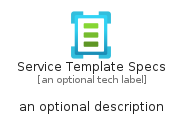
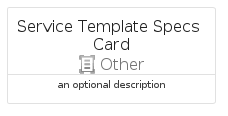
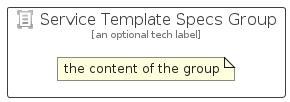

# ServiceTemplateSpecs


```text
azure/Item/Other/ServiceTemplateSpecs
```

```text
include('azure/Item/Other/ServiceTemplateSpecs')
```


| Illustration | ServiceTemplateSpecs | ServiceTemplateSpecsCard | ServiceTemplateSpecsGroup |
| :---: | :---: | :---: | :---: |
|  |  |  |  |


## Sprites
The item provides the following sriptes:

- `<$ServiceTemplateSpecsXs>`
- `<$ServiceTemplateSpecsSm>`
- `<$ServiceTemplateSpecsMd>`
- `<$ServiceTemplateSpecsLg>`


## ServiceTemplateSpecs

### Load remotely
```plantuml
@startuml
' configures the library
!global $LIB_BASE_LOCATION="https://raw.githubusercontent.com/tmorin/plantuml-libs/master/distribution"

' loads the library's bootstrap
!include $LIB_BASE_LOCATION/bootstrap.puml

' loads the package bootstrap
include('azure/bootstrap')

' loads the Item which embeds the element ServiceTemplateSpecs
include('azure/Item/Other/ServiceTemplateSpecs')

' renders the element
ServiceTemplateSpecs('ServiceTemplateSpecs', 'Service Template Specs', 'an optional tech label', 'an optional description')
@enduml
```

### Load locally
```plantuml
@startuml
' configures the library
!global $INCLUSION_MODE="local"
!global $LIB_BASE_LOCATION="../../.."

' loads the library's bootstrap
!include $LIB_BASE_LOCATION/bootstrap.puml

' loads the package bootstrap
include('azure/bootstrap')

' loads the Item which embeds the element ServiceTemplateSpecs
include('azure/Item/Other/ServiceTemplateSpecs')

' renders the element
ServiceTemplateSpecs('ServiceTemplateSpecs', 'Service Template Specs', 'an optional tech label', 'an optional description')
@enduml
```

## ServiceTemplateSpecsCard

### Load remotely
```plantuml
@startuml
' configures the library
!global $LIB_BASE_LOCATION="https://raw.githubusercontent.com/tmorin/plantuml-libs/master/distribution"

' loads the library's bootstrap
!include $LIB_BASE_LOCATION/bootstrap.puml

' loads the package bootstrap
include('azure/bootstrap')

' loads the Item which embeds the element ServiceTemplateSpecsCard
include('azure/Item/Other/ServiceTemplateSpecs')

' renders the element
ServiceTemplateSpecsCard('ServiceTemplateSpecsCard', 'Service Template Specs Card', 'an optional description')
@enduml
```

### Load locally
```plantuml
@startuml
' configures the library
!global $INCLUSION_MODE="local"
!global $LIB_BASE_LOCATION="../../.."

' loads the library's bootstrap
!include $LIB_BASE_LOCATION/bootstrap.puml

' loads the package bootstrap
include('azure/bootstrap')

' loads the Item which embeds the element ServiceTemplateSpecsCard
include('azure/Item/Other/ServiceTemplateSpecs')

' renders the element
ServiceTemplateSpecsCard('ServiceTemplateSpecsCard', 'Service Template Specs Card', 'an optional description')
@enduml
```

## ServiceTemplateSpecsGroup

### Load remotely
```plantuml
@startuml
' configures the library
!global $LIB_BASE_LOCATION="https://raw.githubusercontent.com/tmorin/plantuml-libs/master/distribution"

' loads the library's bootstrap
!include $LIB_BASE_LOCATION/bootstrap.puml

' loads the package bootstrap
include('azure/bootstrap')

' loads the Item which embeds the element ServiceTemplateSpecsGroup
include('azure/Item/Other/ServiceTemplateSpecs')

' renders the element
ServiceTemplateSpecsGroup('ServiceTemplateSpecsGroup', 'Service Template Specs Group', 'an optional tech label') {
    note as note
        the content of the group
    end note
}
@enduml
```

### Load locally
```plantuml
@startuml
' configures the library
!global $INCLUSION_MODE="local"
!global $LIB_BASE_LOCATION="../../.."

' loads the library's bootstrap
!include $LIB_BASE_LOCATION/bootstrap.puml

' loads the package bootstrap
include('azure/bootstrap')

' loads the Item which embeds the element ServiceTemplateSpecsGroup
include('azure/Item/Other/ServiceTemplateSpecs')

' renders the element
ServiceTemplateSpecsGroup('ServiceTemplateSpecsGroup', 'Service Template Specs Group', 'an optional tech label') {
    note as note
        the content of the group
    end note
}
@enduml
```

