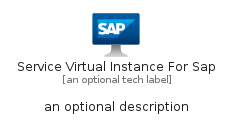
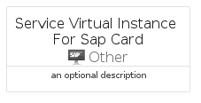
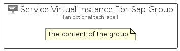

# ServiceVirtualInstanceForSap


```text
azure/Item/Other/ServiceVirtualInstanceForSap
```

```text
include('azure/Item/Other/ServiceVirtualInstanceForSap')
```


| Illustration | ServiceVirtualInstanceForSap | ServiceVirtualInstanceForSapCard | ServiceVirtualInstanceForSapGroup |
| :---: | :---: | :---: | :---: |
|  |  |  |  |


## Sprites
The item provides the following sriptes:

- `<$ServiceVirtualInstanceForSapXs>`
- `<$ServiceVirtualInstanceForSapSm>`
- `<$ServiceVirtualInstanceForSapMd>`
- `<$ServiceVirtualInstanceForSapLg>`


## ServiceVirtualInstanceForSap

### Load remotely
```plantuml
@startuml
' configures the library
!global $LIB_BASE_LOCATION="https://raw.githubusercontent.com/tmorin/plantuml-libs/master/distribution"

' loads the library's bootstrap
!include $LIB_BASE_LOCATION/bootstrap.puml

' loads the package bootstrap
include('azure/bootstrap')

' loads the Item which embeds the element ServiceVirtualInstanceForSap
include('azure/Item/Other/ServiceVirtualInstanceForSap')

' renders the element
ServiceVirtualInstanceForSap('ServiceVirtualInstanceForSap', 'Service Virtual Instance For Sap', 'an optional tech label', 'an optional description')
@enduml
```

### Load locally
```plantuml
@startuml
' configures the library
!global $INCLUSION_MODE="local"
!global $LIB_BASE_LOCATION="../../.."

' loads the library's bootstrap
!include $LIB_BASE_LOCATION/bootstrap.puml

' loads the package bootstrap
include('azure/bootstrap')

' loads the Item which embeds the element ServiceVirtualInstanceForSap
include('azure/Item/Other/ServiceVirtualInstanceForSap')

' renders the element
ServiceVirtualInstanceForSap('ServiceVirtualInstanceForSap', 'Service Virtual Instance For Sap', 'an optional tech label', 'an optional description')
@enduml
```

## ServiceVirtualInstanceForSapCard

### Load remotely
```plantuml
@startuml
' configures the library
!global $LIB_BASE_LOCATION="https://raw.githubusercontent.com/tmorin/plantuml-libs/master/distribution"

' loads the library's bootstrap
!include $LIB_BASE_LOCATION/bootstrap.puml

' loads the package bootstrap
include('azure/bootstrap')

' loads the Item which embeds the element ServiceVirtualInstanceForSapCard
include('azure/Item/Other/ServiceVirtualInstanceForSap')

' renders the element
ServiceVirtualInstanceForSapCard('ServiceVirtualInstanceForSapCard', 'Service Virtual Instance For Sap Card', 'an optional description')
@enduml
```

### Load locally
```plantuml
@startuml
' configures the library
!global $INCLUSION_MODE="local"
!global $LIB_BASE_LOCATION="../../.."

' loads the library's bootstrap
!include $LIB_BASE_LOCATION/bootstrap.puml

' loads the package bootstrap
include('azure/bootstrap')

' loads the Item which embeds the element ServiceVirtualInstanceForSapCard
include('azure/Item/Other/ServiceVirtualInstanceForSap')

' renders the element
ServiceVirtualInstanceForSapCard('ServiceVirtualInstanceForSapCard', 'Service Virtual Instance For Sap Card', 'an optional description')
@enduml
```

## ServiceVirtualInstanceForSapGroup

### Load remotely
```plantuml
@startuml
' configures the library
!global $LIB_BASE_LOCATION="https://raw.githubusercontent.com/tmorin/plantuml-libs/master/distribution"

' loads the library's bootstrap
!include $LIB_BASE_LOCATION/bootstrap.puml

' loads the package bootstrap
include('azure/bootstrap')

' loads the Item which embeds the element ServiceVirtualInstanceForSapGroup
include('azure/Item/Other/ServiceVirtualInstanceForSap')

' renders the element
ServiceVirtualInstanceForSapGroup('ServiceVirtualInstanceForSapGroup', 'Service Virtual Instance For Sap Group', 'an optional tech label') {
    note as note
        the content of the group
    end note
}
@enduml
```

### Load locally
```plantuml
@startuml
' configures the library
!global $INCLUSION_MODE="local"
!global $LIB_BASE_LOCATION="../../.."

' loads the library's bootstrap
!include $LIB_BASE_LOCATION/bootstrap.puml

' loads the package bootstrap
include('azure/bootstrap')

' loads the Item which embeds the element ServiceVirtualInstanceForSapGroup
include('azure/Item/Other/ServiceVirtualInstanceForSap')

' renders the element
ServiceVirtualInstanceForSapGroup('ServiceVirtualInstanceForSapGroup', 'Service Virtual Instance For Sap Group', 'an optional tech label') {
    note as note
        the content of the group
    end note
}
@enduml
```

