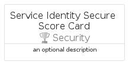
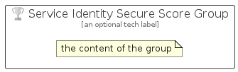

# ServiceIdentitySecureScore


```text
azure/Item/Security/ServiceIdentitySecureScore
```

```text
include('azure/Item/Security/ServiceIdentitySecureScore')
```


| Illustration | ServiceIdentitySecureScore | ServiceIdentitySecureScoreCard | ServiceIdentitySecureScoreGroup |
| :---: | :---: | :---: | :---: |
|  |  |  |  |


## Sprites
The item provides the following sriptes:

- `<$ServiceIdentitySecureScoreXs>`
- `<$ServiceIdentitySecureScoreSm>`
- `<$ServiceIdentitySecureScoreMd>`
- `<$ServiceIdentitySecureScoreLg>`


## ServiceIdentitySecureScore

### Load remotely
```plantuml
@startuml
' configures the library
!global $LIB_BASE_LOCATION="https://raw.githubusercontent.com/tmorin/plantuml-libs/master/distribution"

' loads the library's bootstrap
!include $LIB_BASE_LOCATION/bootstrap.puml

' loads the package bootstrap
include('azure/bootstrap')

' loads the Item which embeds the element ServiceIdentitySecureScore
include('azure/Item/Security/ServiceIdentitySecureScore')

' renders the element
ServiceIdentitySecureScore('ServiceIdentitySecureScore', 'Service Identity Secure Score', 'an optional tech label', 'an optional description')
@enduml
```

### Load locally
```plantuml
@startuml
' configures the library
!global $INCLUSION_MODE="local"
!global $LIB_BASE_LOCATION="../../.."

' loads the library's bootstrap
!include $LIB_BASE_LOCATION/bootstrap.puml

' loads the package bootstrap
include('azure/bootstrap')

' loads the Item which embeds the element ServiceIdentitySecureScore
include('azure/Item/Security/ServiceIdentitySecureScore')

' renders the element
ServiceIdentitySecureScore('ServiceIdentitySecureScore', 'Service Identity Secure Score', 'an optional tech label', 'an optional description')
@enduml
```

## ServiceIdentitySecureScoreCard

### Load remotely
```plantuml
@startuml
' configures the library
!global $LIB_BASE_LOCATION="https://raw.githubusercontent.com/tmorin/plantuml-libs/master/distribution"

' loads the library's bootstrap
!include $LIB_BASE_LOCATION/bootstrap.puml

' loads the package bootstrap
include('azure/bootstrap')

' loads the Item which embeds the element ServiceIdentitySecureScoreCard
include('azure/Item/Security/ServiceIdentitySecureScore')

' renders the element
ServiceIdentitySecureScoreCard('ServiceIdentitySecureScoreCard', 'Service Identity Secure Score Card', 'an optional description')
@enduml
```

### Load locally
```plantuml
@startuml
' configures the library
!global $INCLUSION_MODE="local"
!global $LIB_BASE_LOCATION="../../.."

' loads the library's bootstrap
!include $LIB_BASE_LOCATION/bootstrap.puml

' loads the package bootstrap
include('azure/bootstrap')

' loads the Item which embeds the element ServiceIdentitySecureScoreCard
include('azure/Item/Security/ServiceIdentitySecureScore')

' renders the element
ServiceIdentitySecureScoreCard('ServiceIdentitySecureScoreCard', 'Service Identity Secure Score Card', 'an optional description')
@enduml
```

## ServiceIdentitySecureScoreGroup

### Load remotely
```plantuml
@startuml
' configures the library
!global $LIB_BASE_LOCATION="https://raw.githubusercontent.com/tmorin/plantuml-libs/master/distribution"

' loads the library's bootstrap
!include $LIB_BASE_LOCATION/bootstrap.puml

' loads the package bootstrap
include('azure/bootstrap')

' loads the Item which embeds the element ServiceIdentitySecureScoreGroup
include('azure/Item/Security/ServiceIdentitySecureScore')

' renders the element
ServiceIdentitySecureScoreGroup('ServiceIdentitySecureScoreGroup', 'Service Identity Secure Score Group', 'an optional tech label') {
    note as note
        the content of the group
    end note
}
@enduml
```

### Load locally
```plantuml
@startuml
' configures the library
!global $INCLUSION_MODE="local"
!global $LIB_BASE_LOCATION="../../.."

' loads the library's bootstrap
!include $LIB_BASE_LOCATION/bootstrap.puml

' loads the package bootstrap
include('azure/bootstrap')

' loads the Item which embeds the element ServiceIdentitySecureScoreGroup
include('azure/Item/Security/ServiceIdentitySecureScore')

' renders the element
ServiceIdentitySecureScoreGroup('ServiceIdentitySecureScoreGroup', 'Service Identity Secure Score Group', 'an optional tech label') {
    note as note
        the content of the group
    end note
}
@enduml
```

