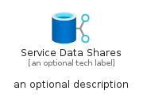
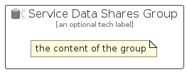

# ServiceDataShares


```text
azure/Item/Storage/ServiceDataShares
```

```text
include('azure/Item/Storage/ServiceDataShares')
```


| Illustration | ServiceDataShares | ServiceDataSharesCard | ServiceDataSharesGroup |
| :---: | :---: | :---: | :---: |
|  |  |  |  |


## Sprites
The item provides the following sriptes:

- `<$ServiceDataSharesXs>`
- `<$ServiceDataSharesSm>`
- `<$ServiceDataSharesMd>`
- `<$ServiceDataSharesLg>`


## ServiceDataShares

### Load remotely
```plantuml
@startuml
' configures the library
!global $LIB_BASE_LOCATION="https://raw.githubusercontent.com/tmorin/plantuml-libs/master/distribution"

' loads the library's bootstrap
!include $LIB_BASE_LOCATION/bootstrap.puml

' loads the package bootstrap
include('azure/bootstrap')

' loads the Item which embeds the element ServiceDataShares
include('azure/Item/Storage/ServiceDataShares')

' renders the element
ServiceDataShares('ServiceDataShares', 'Service Data Shares', 'an optional tech label', 'an optional description')
@enduml
```

### Load locally
```plantuml
@startuml
' configures the library
!global $INCLUSION_MODE="local"
!global $LIB_BASE_LOCATION="../../.."

' loads the library's bootstrap
!include $LIB_BASE_LOCATION/bootstrap.puml

' loads the package bootstrap
include('azure/bootstrap')

' loads the Item which embeds the element ServiceDataShares
include('azure/Item/Storage/ServiceDataShares')

' renders the element
ServiceDataShares('ServiceDataShares', 'Service Data Shares', 'an optional tech label', 'an optional description')
@enduml
```

## ServiceDataSharesCard

### Load remotely
```plantuml
@startuml
' configures the library
!global $LIB_BASE_LOCATION="https://raw.githubusercontent.com/tmorin/plantuml-libs/master/distribution"

' loads the library's bootstrap
!include $LIB_BASE_LOCATION/bootstrap.puml

' loads the package bootstrap
include('azure/bootstrap')

' loads the Item which embeds the element ServiceDataSharesCard
include('azure/Item/Storage/ServiceDataShares')

' renders the element
ServiceDataSharesCard('ServiceDataSharesCard', 'Service Data Shares Card', 'an optional description')
@enduml
```

### Load locally
```plantuml
@startuml
' configures the library
!global $INCLUSION_MODE="local"
!global $LIB_BASE_LOCATION="../../.."

' loads the library's bootstrap
!include $LIB_BASE_LOCATION/bootstrap.puml

' loads the package bootstrap
include('azure/bootstrap')

' loads the Item which embeds the element ServiceDataSharesCard
include('azure/Item/Storage/ServiceDataShares')

' renders the element
ServiceDataSharesCard('ServiceDataSharesCard', 'Service Data Shares Card', 'an optional description')
@enduml
```

## ServiceDataSharesGroup

### Load remotely
```plantuml
@startuml
' configures the library
!global $LIB_BASE_LOCATION="https://raw.githubusercontent.com/tmorin/plantuml-libs/master/distribution"

' loads the library's bootstrap
!include $LIB_BASE_LOCATION/bootstrap.puml

' loads the package bootstrap
include('azure/bootstrap')

' loads the Item which embeds the element ServiceDataSharesGroup
include('azure/Item/Storage/ServiceDataShares')

' renders the element
ServiceDataSharesGroup('ServiceDataSharesGroup', 'Service Data Shares Group', 'an optional tech label') {
    note as note
        the content of the group
    end note
}
@enduml
```

### Load locally
```plantuml
@startuml
' configures the library
!global $INCLUSION_MODE="local"
!global $LIB_BASE_LOCATION="../../.."

' loads the library's bootstrap
!include $LIB_BASE_LOCATION/bootstrap.puml

' loads the package bootstrap
include('azure/bootstrap')

' loads the Item which embeds the element ServiceDataSharesGroup
include('azure/Item/Storage/ServiceDataShares')

' renders the element
ServiceDataSharesGroup('ServiceDataSharesGroup', 'Service Data Shares Group', 'an optional tech label') {
    note as note
        the content of the group
    end note
}
@enduml
```

