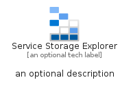
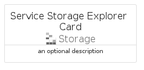
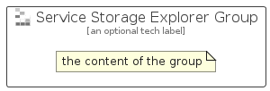

# ServiceStorageExplorer


```text
azure/Item/Storage/ServiceStorageExplorer
```

```text
include('azure/Item/Storage/ServiceStorageExplorer')
```


| Illustration | ServiceStorageExplorer | ServiceStorageExplorerCard | ServiceStorageExplorerGroup |
| :---: | :---: | :---: | :---: |
|  |  |  |  |


## Sprites
The item provides the following sriptes:

- `<$ServiceStorageExplorerXs>`
- `<$ServiceStorageExplorerSm>`
- `<$ServiceStorageExplorerMd>`
- `<$ServiceStorageExplorerLg>`


## ServiceStorageExplorer

### Load remotely
```plantuml
@startuml
' configures the library
!global $LIB_BASE_LOCATION="https://raw.githubusercontent.com/tmorin/plantuml-libs/master/distribution"

' loads the library's bootstrap
!include $LIB_BASE_LOCATION/bootstrap.puml

' loads the package bootstrap
include('azure/bootstrap')

' loads the Item which embeds the element ServiceStorageExplorer
include('azure/Item/Storage/ServiceStorageExplorer')

' renders the element
ServiceStorageExplorer('ServiceStorageExplorer', 'Service Storage Explorer', 'an optional tech label', 'an optional description')
@enduml
```

### Load locally
```plantuml
@startuml
' configures the library
!global $INCLUSION_MODE="local"
!global $LIB_BASE_LOCATION="../../.."

' loads the library's bootstrap
!include $LIB_BASE_LOCATION/bootstrap.puml

' loads the package bootstrap
include('azure/bootstrap')

' loads the Item which embeds the element ServiceStorageExplorer
include('azure/Item/Storage/ServiceStorageExplorer')

' renders the element
ServiceStorageExplorer('ServiceStorageExplorer', 'Service Storage Explorer', 'an optional tech label', 'an optional description')
@enduml
```

## ServiceStorageExplorerCard

### Load remotely
```plantuml
@startuml
' configures the library
!global $LIB_BASE_LOCATION="https://raw.githubusercontent.com/tmorin/plantuml-libs/master/distribution"

' loads the library's bootstrap
!include $LIB_BASE_LOCATION/bootstrap.puml

' loads the package bootstrap
include('azure/bootstrap')

' loads the Item which embeds the element ServiceStorageExplorerCard
include('azure/Item/Storage/ServiceStorageExplorer')

' renders the element
ServiceStorageExplorerCard('ServiceStorageExplorerCard', 'Service Storage Explorer Card', 'an optional description')
@enduml
```

### Load locally
```plantuml
@startuml
' configures the library
!global $INCLUSION_MODE="local"
!global $LIB_BASE_LOCATION="../../.."

' loads the library's bootstrap
!include $LIB_BASE_LOCATION/bootstrap.puml

' loads the package bootstrap
include('azure/bootstrap')

' loads the Item which embeds the element ServiceStorageExplorerCard
include('azure/Item/Storage/ServiceStorageExplorer')

' renders the element
ServiceStorageExplorerCard('ServiceStorageExplorerCard', 'Service Storage Explorer Card', 'an optional description')
@enduml
```

## ServiceStorageExplorerGroup

### Load remotely
```plantuml
@startuml
' configures the library
!global $LIB_BASE_LOCATION="https://raw.githubusercontent.com/tmorin/plantuml-libs/master/distribution"

' loads the library's bootstrap
!include $LIB_BASE_LOCATION/bootstrap.puml

' loads the package bootstrap
include('azure/bootstrap')

' loads the Item which embeds the element ServiceStorageExplorerGroup
include('azure/Item/Storage/ServiceStorageExplorer')

' renders the element
ServiceStorageExplorerGroup('ServiceStorageExplorerGroup', 'Service Storage Explorer Group', 'an optional tech label') {
    note as note
        the content of the group
    end note
}
@enduml
```

### Load locally
```plantuml
@startuml
' configures the library
!global $INCLUSION_MODE="local"
!global $LIB_BASE_LOCATION="../../.."

' loads the library's bootstrap
!include $LIB_BASE_LOCATION/bootstrap.puml

' loads the package bootstrap
include('azure/bootstrap')

' loads the Item which embeds the element ServiceStorageExplorerGroup
include('azure/Item/Storage/ServiceStorageExplorer')

' renders the element
ServiceStorageExplorerGroup('ServiceStorageExplorerGroup', 'Service Storage Explorer Group', 'an optional tech label') {
    note as note
        the content of the group
    end note
}
@enduml
```

