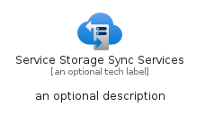
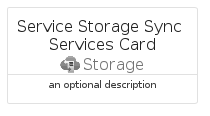
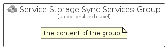

# ServiceStorageSyncServices


```text
azure/Item/Storage/ServiceStorageSyncServices
```

```text
include('azure/Item/Storage/ServiceStorageSyncServices')
```


| Illustration | ServiceStorageSyncServices | ServiceStorageSyncServicesCard | ServiceStorageSyncServicesGroup |
| :---: | :---: | :---: | :---: |
|  |  |  |  |


## Sprites
The item provides the following sriptes:

- `<$ServiceStorageSyncServicesXs>`
- `<$ServiceStorageSyncServicesSm>`
- `<$ServiceStorageSyncServicesMd>`
- `<$ServiceStorageSyncServicesLg>`


## ServiceStorageSyncServices

### Load remotely
```plantuml
@startuml
' configures the library
!global $LIB_BASE_LOCATION="https://raw.githubusercontent.com/tmorin/plantuml-libs/master/distribution"

' loads the library's bootstrap
!include $LIB_BASE_LOCATION/bootstrap.puml

' loads the package bootstrap
include('azure/bootstrap')

' loads the Item which embeds the element ServiceStorageSyncServices
include('azure/Item/Storage/ServiceStorageSyncServices')

' renders the element
ServiceStorageSyncServices('ServiceStorageSyncServices', 'Service Storage Sync Services', 'an optional tech label', 'an optional description')
@enduml
```

### Load locally
```plantuml
@startuml
' configures the library
!global $INCLUSION_MODE="local"
!global $LIB_BASE_LOCATION="../../.."

' loads the library's bootstrap
!include $LIB_BASE_LOCATION/bootstrap.puml

' loads the package bootstrap
include('azure/bootstrap')

' loads the Item which embeds the element ServiceStorageSyncServices
include('azure/Item/Storage/ServiceStorageSyncServices')

' renders the element
ServiceStorageSyncServices('ServiceStorageSyncServices', 'Service Storage Sync Services', 'an optional tech label', 'an optional description')
@enduml
```

## ServiceStorageSyncServicesCard

### Load remotely
```plantuml
@startuml
' configures the library
!global $LIB_BASE_LOCATION="https://raw.githubusercontent.com/tmorin/plantuml-libs/master/distribution"

' loads the library's bootstrap
!include $LIB_BASE_LOCATION/bootstrap.puml

' loads the package bootstrap
include('azure/bootstrap')

' loads the Item which embeds the element ServiceStorageSyncServicesCard
include('azure/Item/Storage/ServiceStorageSyncServices')

' renders the element
ServiceStorageSyncServicesCard('ServiceStorageSyncServicesCard', 'Service Storage Sync Services Card', 'an optional description')
@enduml
```

### Load locally
```plantuml
@startuml
' configures the library
!global $INCLUSION_MODE="local"
!global $LIB_BASE_LOCATION="../../.."

' loads the library's bootstrap
!include $LIB_BASE_LOCATION/bootstrap.puml

' loads the package bootstrap
include('azure/bootstrap')

' loads the Item which embeds the element ServiceStorageSyncServicesCard
include('azure/Item/Storage/ServiceStorageSyncServices')

' renders the element
ServiceStorageSyncServicesCard('ServiceStorageSyncServicesCard', 'Service Storage Sync Services Card', 'an optional description')
@enduml
```

## ServiceStorageSyncServicesGroup

### Load remotely
```plantuml
@startuml
' configures the library
!global $LIB_BASE_LOCATION="https://raw.githubusercontent.com/tmorin/plantuml-libs/master/distribution"

' loads the library's bootstrap
!include $LIB_BASE_LOCATION/bootstrap.puml

' loads the package bootstrap
include('azure/bootstrap')

' loads the Item which embeds the element ServiceStorageSyncServicesGroup
include('azure/Item/Storage/ServiceStorageSyncServices')

' renders the element
ServiceStorageSyncServicesGroup('ServiceStorageSyncServicesGroup', 'Service Storage Sync Services Group', 'an optional tech label') {
    note as note
        the content of the group
    end note
}
@enduml
```

### Load locally
```plantuml
@startuml
' configures the library
!global $INCLUSION_MODE="local"
!global $LIB_BASE_LOCATION="../../.."

' loads the library's bootstrap
!include $LIB_BASE_LOCATION/bootstrap.puml

' loads the package bootstrap
include('azure/bootstrap')

' loads the Item which embeds the element ServiceStorageSyncServicesGroup
include('azure/Item/Storage/ServiceStorageSyncServices')

' renders the element
ServiceStorageSyncServicesGroup('ServiceStorageSyncServicesGroup', 'Service Storage Sync Services Group', 'an optional tech label') {
    note as note
        the content of the group
    end note
}
@enduml
```

