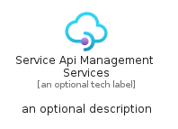
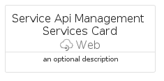
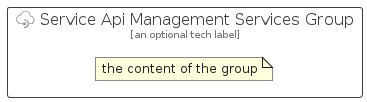

# ServiceApiManagementServices


```text
azure/Item/Web/ServiceApiManagementServices
```

```text
include('azure/Item/Web/ServiceApiManagementServices')
```


| Illustration | ServiceApiManagementServices | ServiceApiManagementServicesCard | ServiceApiManagementServicesGroup |
| :---: | :---: | :---: | :---: |
|  |  |  |  |


## Sprites
The item provides the following sriptes:

- `<$ServiceApiManagementServicesXs>`
- `<$ServiceApiManagementServicesSm>`
- `<$ServiceApiManagementServicesMd>`
- `<$ServiceApiManagementServicesLg>`


## ServiceApiManagementServices

### Load remotely
```plantuml
@startuml
' configures the library
!global $LIB_BASE_LOCATION="https://raw.githubusercontent.com/tmorin/plantuml-libs/master/distribution"

' loads the library's bootstrap
!include $LIB_BASE_LOCATION/bootstrap.puml

' loads the package bootstrap
include('azure/bootstrap')

' loads the Item which embeds the element ServiceApiManagementServices
include('azure/Item/Web/ServiceApiManagementServices')

' renders the element
ServiceApiManagementServices('ServiceApiManagementServices', 'Service Api Management Services', 'an optional tech label', 'an optional description')
@enduml
```

### Load locally
```plantuml
@startuml
' configures the library
!global $INCLUSION_MODE="local"
!global $LIB_BASE_LOCATION="../../.."

' loads the library's bootstrap
!include $LIB_BASE_LOCATION/bootstrap.puml

' loads the package bootstrap
include('azure/bootstrap')

' loads the Item which embeds the element ServiceApiManagementServices
include('azure/Item/Web/ServiceApiManagementServices')

' renders the element
ServiceApiManagementServices('ServiceApiManagementServices', 'Service Api Management Services', 'an optional tech label', 'an optional description')
@enduml
```

## ServiceApiManagementServicesCard

### Load remotely
```plantuml
@startuml
' configures the library
!global $LIB_BASE_LOCATION="https://raw.githubusercontent.com/tmorin/plantuml-libs/master/distribution"

' loads the library's bootstrap
!include $LIB_BASE_LOCATION/bootstrap.puml

' loads the package bootstrap
include('azure/bootstrap')

' loads the Item which embeds the element ServiceApiManagementServicesCard
include('azure/Item/Web/ServiceApiManagementServices')

' renders the element
ServiceApiManagementServicesCard('ServiceApiManagementServicesCard', 'Service Api Management Services Card', 'an optional description')
@enduml
```

### Load locally
```plantuml
@startuml
' configures the library
!global $INCLUSION_MODE="local"
!global $LIB_BASE_LOCATION="../../.."

' loads the library's bootstrap
!include $LIB_BASE_LOCATION/bootstrap.puml

' loads the package bootstrap
include('azure/bootstrap')

' loads the Item which embeds the element ServiceApiManagementServicesCard
include('azure/Item/Web/ServiceApiManagementServices')

' renders the element
ServiceApiManagementServicesCard('ServiceApiManagementServicesCard', 'Service Api Management Services Card', 'an optional description')
@enduml
```

## ServiceApiManagementServicesGroup

### Load remotely
```plantuml
@startuml
' configures the library
!global $LIB_BASE_LOCATION="https://raw.githubusercontent.com/tmorin/plantuml-libs/master/distribution"

' loads the library's bootstrap
!include $LIB_BASE_LOCATION/bootstrap.puml

' loads the package bootstrap
include('azure/bootstrap')

' loads the Item which embeds the element ServiceApiManagementServicesGroup
include('azure/Item/Web/ServiceApiManagementServices')

' renders the element
ServiceApiManagementServicesGroup('ServiceApiManagementServicesGroup', 'Service Api Management Services Group', 'an optional tech label') {
    note as note
        the content of the group
    end note
}
@enduml
```

### Load locally
```plantuml
@startuml
' configures the library
!global $INCLUSION_MODE="local"
!global $LIB_BASE_LOCATION="../../.."

' loads the library's bootstrap
!include $LIB_BASE_LOCATION/bootstrap.puml

' loads the package bootstrap
include('azure/bootstrap')

' loads the Item which embeds the element ServiceApiManagementServicesGroup
include('azure/Item/Web/ServiceApiManagementServices')

' renders the element
ServiceApiManagementServicesGroup('ServiceApiManagementServicesGroup', 'Service Api Management Services Group', 'an optional tech label') {
    note as note
        the content of the group
    end note
}
@enduml
```

