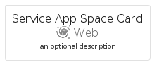
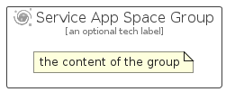

# ServiceAppSpace


```text
azure/Item/Web/ServiceAppSpace
```

```text
include('azure/Item/Web/ServiceAppSpace')
```


| Illustration | ServiceAppSpace | ServiceAppSpaceCard | ServiceAppSpaceGroup |
| :---: | :---: | :---: | :---: |
|  |  |  |  |


## Sprites
The item provides the following sriptes:

- `<$ServiceAppSpaceXs>`
- `<$ServiceAppSpaceSm>`
- `<$ServiceAppSpaceMd>`
- `<$ServiceAppSpaceLg>`


## ServiceAppSpace

### Load remotely
```plantuml
@startuml
' configures the library
!global $LIB_BASE_LOCATION="https://raw.githubusercontent.com/tmorin/plantuml-libs/master/distribution"

' loads the library's bootstrap
!include $LIB_BASE_LOCATION/bootstrap.puml

' loads the package bootstrap
include('azure/bootstrap')

' loads the Item which embeds the element ServiceAppSpace
include('azure/Item/Web/ServiceAppSpace')

' renders the element
ServiceAppSpace('ServiceAppSpace', 'Service App Space', 'an optional tech label', 'an optional description')
@enduml
```

### Load locally
```plantuml
@startuml
' configures the library
!global $INCLUSION_MODE="local"
!global $LIB_BASE_LOCATION="../../.."

' loads the library's bootstrap
!include $LIB_BASE_LOCATION/bootstrap.puml

' loads the package bootstrap
include('azure/bootstrap')

' loads the Item which embeds the element ServiceAppSpace
include('azure/Item/Web/ServiceAppSpace')

' renders the element
ServiceAppSpace('ServiceAppSpace', 'Service App Space', 'an optional tech label', 'an optional description')
@enduml
```

## ServiceAppSpaceCard

### Load remotely
```plantuml
@startuml
' configures the library
!global $LIB_BASE_LOCATION="https://raw.githubusercontent.com/tmorin/plantuml-libs/master/distribution"

' loads the library's bootstrap
!include $LIB_BASE_LOCATION/bootstrap.puml

' loads the package bootstrap
include('azure/bootstrap')

' loads the Item which embeds the element ServiceAppSpaceCard
include('azure/Item/Web/ServiceAppSpace')

' renders the element
ServiceAppSpaceCard('ServiceAppSpaceCard', 'Service App Space Card', 'an optional description')
@enduml
```

### Load locally
```plantuml
@startuml
' configures the library
!global $INCLUSION_MODE="local"
!global $LIB_BASE_LOCATION="../../.."

' loads the library's bootstrap
!include $LIB_BASE_LOCATION/bootstrap.puml

' loads the package bootstrap
include('azure/bootstrap')

' loads the Item which embeds the element ServiceAppSpaceCard
include('azure/Item/Web/ServiceAppSpace')

' renders the element
ServiceAppSpaceCard('ServiceAppSpaceCard', 'Service App Space Card', 'an optional description')
@enduml
```

## ServiceAppSpaceGroup

### Load remotely
```plantuml
@startuml
' configures the library
!global $LIB_BASE_LOCATION="https://raw.githubusercontent.com/tmorin/plantuml-libs/master/distribution"

' loads the library's bootstrap
!include $LIB_BASE_LOCATION/bootstrap.puml

' loads the package bootstrap
include('azure/bootstrap')

' loads the Item which embeds the element ServiceAppSpaceGroup
include('azure/Item/Web/ServiceAppSpace')

' renders the element
ServiceAppSpaceGroup('ServiceAppSpaceGroup', 'Service App Space Group', 'an optional tech label') {
    note as note
        the content of the group
    end note
}
@enduml
```

### Load locally
```plantuml
@startuml
' configures the library
!global $INCLUSION_MODE="local"
!global $LIB_BASE_LOCATION="../../.."

' loads the library's bootstrap
!include $LIB_BASE_LOCATION/bootstrap.puml

' loads the package bootstrap
include('azure/bootstrap')

' loads the Item which embeds the element ServiceAppSpaceGroup
include('azure/Item/Web/ServiceAppSpace')

' renders the element
ServiceAppSpaceGroup('ServiceAppSpaceGroup', 'Service App Space Group', 'an optional tech label') {
    note as note
        the content of the group
    end note
}
@enduml
```

