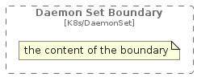

# DaemonSetBoundary


```text
c4k8s/Boundary/DaemonSetBoundary
```

```text
include('c4k8s/Boundary/DaemonSetBoundary')
```


| DaemonSetBoundary |
| :---: |
|  |


## DaemonSetBoundary

### Load remotely
```plantuml
@startuml
' configures the library
!global $LIB_BASE_LOCATION="https://raw.githubusercontent.com/tmorin/plantuml-libs/master/distribution"

' loads the library's bootstrap
!include $LIB_BASE_LOCATION/bootstrap.puml

' loads the package bootstrap
include('c4k8s/bootstrap')

' loads the Item which embeds the element DaemonSetBoundary
include('c4k8s/Boundary/DaemonSetBoundary')

' load the c4model package
include('c4model/bootstrap')
DaemonSetBoundary('DaemonSetBoundary', 'Daemon Set Boundary') {
  note as note
  the content of the boundary
  end note
}
@enduml
```

### Load locally
```plantuml
@startuml
' configures the library
!global $INCLUSION_MODE="local"
!global $LIB_BASE_LOCATION="../.."

' loads the library's bootstrap
!include $LIB_BASE_LOCATION/bootstrap.puml

' loads the package bootstrap
include('c4k8s/bootstrap')

' loads the Item which embeds the element DaemonSetBoundary
include('c4k8s/Boundary/DaemonSetBoundary')

' load the c4model package
include('c4model/bootstrap')
DaemonSetBoundary('DaemonSetBoundary', 'Daemon Set Boundary') {
  note as note
  the content of the boundary
  end note
}
@enduml
```

