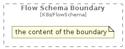

# FlowSchemaBoundary


```text
c4k8s/Boundary/FlowSchemaBoundary
```

```text
include('c4k8s/Boundary/FlowSchemaBoundary')
```


| FlowSchemaBoundary |
| :---: |
|  |


## FlowSchemaBoundary

### Load remotely
```plantuml
@startuml
' configures the library
!global $LIB_BASE_LOCATION="https://raw.githubusercontent.com/tmorin/plantuml-libs/master/distribution"

' loads the library's bootstrap
!include $LIB_BASE_LOCATION/bootstrap.puml

' loads the package bootstrap
include('c4k8s/bootstrap')

' loads the Item which embeds the element FlowSchemaBoundary
include('c4k8s/Boundary/FlowSchemaBoundary')

' load the c4model package
include('c4model/bootstrap')
FlowSchemaBoundary('FlowSchemaBoundary', 'Flow Schema Boundary') {
  note as note
  the content of the boundary
  end note
}
@enduml
```

### Load locally
```plantuml
@startuml
' configures the library
!global $INCLUSION_MODE="local"
!global $LIB_BASE_LOCATION="../.."

' loads the library's bootstrap
!include $LIB_BASE_LOCATION/bootstrap.puml

' loads the package bootstrap
include('c4k8s/bootstrap')

' loads the Item which embeds the element FlowSchemaBoundary
include('c4k8s/Boundary/FlowSchemaBoundary')

' load the c4model package
include('c4model/bootstrap')
FlowSchemaBoundary('FlowSchemaBoundary', 'Flow Schema Boundary') {
  note as note
  the content of the boundary
  end note
}
@enduml
```

