# Boundary

The module contains 78 items.

| |Name|
|:---:|---|
|  | [c4k8s/Boundary/APIServiceBoundary](../../c4k8s/Boundary/APIServiceBoundary.md) |
|  | [c4k8s/Boundary/BindingBoundary](../../c4k8s/Boundary/BindingBoundary.md) |
|  | [c4k8s/Boundary/CSIDriverBoundary](../../c4k8s/Boundary/CSIDriverBoundary.md) |
|  | [c4k8s/Boundary/CSINodeBoundary](../../c4k8s/Boundary/CSINodeBoundary.md) |
| 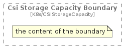 | [c4k8s/Boundary/CSIStorageCapacityBoundary](../../c4k8s/Boundary/CSIStorageCapacityBoundary.md) |
|  | [c4k8s/Boundary/CertificateSigningRequestBoundary](../../c4k8s/Boundary/CertificateSigningRequestBoundary.md) |
|  | [c4k8s/Boundary/ClusterBoundary](../../c4k8s/Boundary/ClusterBoundary.md) |
| 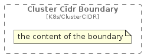 | [c4k8s/Boundary/ClusterCIDRBoundary](../../c4k8s/Boundary/ClusterCIDRBoundary.md) |
|  | [c4k8s/Boundary/ClusterRoleBindingBoundary](../../c4k8s/Boundary/ClusterRoleBindingBoundary.md) |
|  | [c4k8s/Boundary/ClusterRoleBoundary](../../c4k8s/Boundary/ClusterRoleBoundary.md) |
|  | [c4k8s/Boundary/ComponentStatusBoundary](../../c4k8s/Boundary/ComponentStatusBoundary.md) |
|  | [c4k8s/Boundary/ConfigMapBoundary](../../c4k8s/Boundary/ConfigMapBoundary.md) |
| 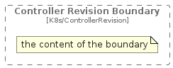 | [c4k8s/Boundary/ControllerRevisionBoundary](../../c4k8s/Boundary/ControllerRevisionBoundary.md) |
|  | [c4k8s/Boundary/CronJobBoundary](../../c4k8s/Boundary/CronJobBoundary.md) |
| 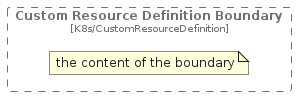 | [c4k8s/Boundary/CustomResourceDefinitionBoundary](../../c4k8s/Boundary/CustomResourceDefinitionBoundary.md) |
|  | [c4k8s/Boundary/DaemonSetBoundary](../../c4k8s/Boundary/DaemonSetBoundary.md) |
|  | [c4k8s/Boundary/DeleteOptionsBoundary](../../c4k8s/Boundary/DeleteOptionsBoundary.md) |
|  | [c4k8s/Boundary/DeploymentBoundary](../../c4k8s/Boundary/DeploymentBoundary.md) |
| 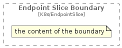 | [c4k8s/Boundary/EndpointSliceBoundary](../../c4k8s/Boundary/EndpointSliceBoundary.md) |
|  | [c4k8s/Boundary/EndpointsBoundary](../../c4k8s/Boundary/EndpointsBoundary.md) |
| 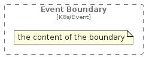 | [c4k8s/Boundary/EventBoundary](../../c4k8s/Boundary/EventBoundary.md) |
|  | [c4k8s/Boundary/FlowSchemaBoundary](../../c4k8s/Boundary/FlowSchemaBoundary.md) |
|  | [c4k8s/Boundary/HorizontalPodAutoscalerBoundary](../../c4k8s/Boundary/HorizontalPodAutoscalerBoundary.md) |
|  | [c4k8s/Boundary/IngressBoundary](../../c4k8s/Boundary/IngressBoundary.md) |
|  | [c4k8s/Boundary/IngressClassBoundary](../../c4k8s/Boundary/IngressClassBoundary.md) |
| 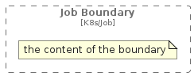 | [c4k8s/Boundary/JobBoundary](../../c4k8s/Boundary/JobBoundary.md) |
|  | [c4k8s/Boundary/LabelSelectorBoundary](../../c4k8s/Boundary/LabelSelectorBoundary.md) |
|  | [c4k8s/Boundary/LeaseBoundary](../../c4k8s/Boundary/LeaseBoundary.md) |
|  | [c4k8s/Boundary/LimitRangeBoundary](../../c4k8s/Boundary/LimitRangeBoundary.md) |
|  | [c4k8s/Boundary/ListMetaBoundary](../../c4k8s/Boundary/ListMetaBoundary.md) |
| 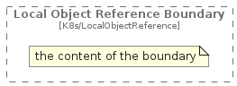 | [c4k8s/Boundary/LocalObjectReferenceBoundary](../../c4k8s/Boundary/LocalObjectReferenceBoundary.md) |
|  | [c4k8s/Boundary/LocalSubjectAccessReviewBoundary](../../c4k8s/Boundary/LocalSubjectAccessReviewBoundary.md) |
|  | [c4k8s/Boundary/MutatingWebhookConfigurationBoundary](../../c4k8s/Boundary/MutatingWebhookConfigurationBoundary.md) |
|  | [c4k8s/Boundary/NamespaceBoundary](../../c4k8s/Boundary/NamespaceBoundary.md) |
|  | [c4k8s/Boundary/NetworkPolicyBoundary](../../c4k8s/Boundary/NetworkPolicyBoundary.md) |
| 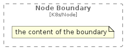 | [c4k8s/Boundary/NodeBoundary](../../c4k8s/Boundary/NodeBoundary.md) |
|  | [c4k8s/Boundary/NodeSelectorRequirementBoundary](../../c4k8s/Boundary/NodeSelectorRequirementBoundary.md) |
|  | [c4k8s/Boundary/ObjectFieldSelectorBoundary](../../c4k8s/Boundary/ObjectFieldSelectorBoundary.md) |
| 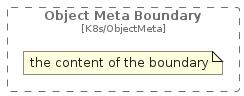 | [c4k8s/Boundary/ObjectMetaBoundary](../../c4k8s/Boundary/ObjectMetaBoundary.md) |
| 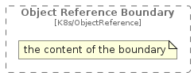 | [c4k8s/Boundary/ObjectReferenceBoundary](../../c4k8s/Boundary/ObjectReferenceBoundary.md) |
|  | [c4k8s/Boundary/PatchBoundary](../../c4k8s/Boundary/PatchBoundary.md) |
|  | [c4k8s/Boundary/PersistentVolumeBoundary](../../c4k8s/Boundary/PersistentVolumeBoundary.md) |
|  | [c4k8s/Boundary/PersistentVolumeClaimBoundary](../../c4k8s/Boundary/PersistentVolumeClaimBoundary.md) |
|  | [c4k8s/Boundary/PodBoundary](../../c4k8s/Boundary/PodBoundary.md) |
| 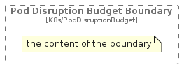 | [c4k8s/Boundary/PodDisruptionBudgetBoundary](../../c4k8s/Boundary/PodDisruptionBudgetBoundary.md) |
| 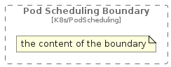 | [c4k8s/Boundary/PodSchedulingBoundary](../../c4k8s/Boundary/PodSchedulingBoundary.md) |
| 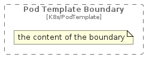 | [c4k8s/Boundary/PodTemplateBoundary](../../c4k8s/Boundary/PodTemplateBoundary.md) |
|  | [c4k8s/Boundary/PriorityClassBoundary](../../c4k8s/Boundary/PriorityClassBoundary.md) |
|  | [c4k8s/Boundary/PriorityLevelConfigurationBoundary](../../c4k8s/Boundary/PriorityLevelConfigurationBoundary.md) |
| 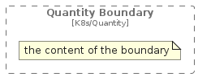 | [c4k8s/Boundary/QuantityBoundary](../../c4k8s/Boundary/QuantityBoundary.md) |
| 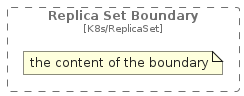 | [c4k8s/Boundary/ReplicaSetBoundary](../../c4k8s/Boundary/ReplicaSetBoundary.md) |
|  | [c4k8s/Boundary/ReplicationControllerBoundary](../../c4k8s/Boundary/ReplicationControllerBoundary.md) |
|  | [c4k8s/Boundary/ResourceClaimBoundary](../../c4k8s/Boundary/ResourceClaimBoundary.md) |
|  | [c4k8s/Boundary/ResourceClaimTemplateBoundary](../../c4k8s/Boundary/ResourceClaimTemplateBoundary.md) |
|  | [c4k8s/Boundary/ResourceClassBoundary](../../c4k8s/Boundary/ResourceClassBoundary.md) |
|  | [c4k8s/Boundary/ResourceFieldSelectorBoundary](../../c4k8s/Boundary/ResourceFieldSelectorBoundary.md) |
| 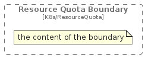 | [c4k8s/Boundary/ResourceQuotaBoundary](../../c4k8s/Boundary/ResourceQuotaBoundary.md) |
|  | [c4k8s/Boundary/RoleBindingBoundary](../../c4k8s/Boundary/RoleBindingBoundary.md) |
|  | [c4k8s/Boundary/RoleBoundary](../../c4k8s/Boundary/RoleBoundary.md) |
| 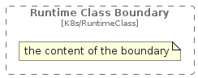 | [c4k8s/Boundary/RuntimeClassBoundary](../../c4k8s/Boundary/RuntimeClassBoundary.md) |
|  | [c4k8s/Boundary/SecretBoundary](../../c4k8s/Boundary/SecretBoundary.md) |
|  | [c4k8s/Boundary/SelfSubjectAccessReviewBoundary](../../c4k8s/Boundary/SelfSubjectAccessReviewBoundary.md) |
|  | [c4k8s/Boundary/SelfSubjectReviewBoundary](../../c4k8s/Boundary/SelfSubjectReviewBoundary.md) |
|  | [c4k8s/Boundary/SelfSubjectRulesReviewBoundary](../../c4k8s/Boundary/SelfSubjectRulesReviewBoundary.md) |
|  | [c4k8s/Boundary/ServiceAccountBoundary](../../c4k8s/Boundary/ServiceAccountBoundary.md) |
|  | [c4k8s/Boundary/ServiceBoundary](../../c4k8s/Boundary/ServiceBoundary.md) |
| 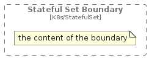 | [c4k8s/Boundary/StatefulSetBoundary](../../c4k8s/Boundary/StatefulSetBoundary.md) |
|  | [c4k8s/Boundary/StatusBoundary](../../c4k8s/Boundary/StatusBoundary.md) |
|  | [c4k8s/Boundary/StorageClassBoundary](../../c4k8s/Boundary/StorageClassBoundary.md) |
|  | [c4k8s/Boundary/SubjectAccessReviewBoundary](../../c4k8s/Boundary/SubjectAccessReviewBoundary.md) |
|  | [c4k8s/Boundary/TokenRequestBoundary](../../c4k8s/Boundary/TokenRequestBoundary.md) |
|  | [c4k8s/Boundary/TokenReviewBoundary](../../c4k8s/Boundary/TokenReviewBoundary.md) |
| 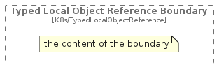 | [c4k8s/Boundary/TypedLocalObjectReferenceBoundary](../../c4k8s/Boundary/TypedLocalObjectReferenceBoundary.md) |
|  | [c4k8s/Boundary/ValidatingAdmissionPolicyBindingListBoundary](../../c4k8s/Boundary/ValidatingAdmissionPolicyBindingListBoundary.md) |
| 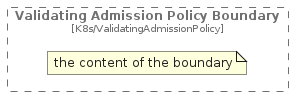 | [c4k8s/Boundary/ValidatingAdmissionPolicyBoundary](../../c4k8s/Boundary/ValidatingAdmissionPolicyBoundary.md) |
| 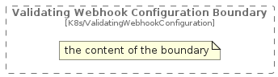 | [c4k8s/Boundary/ValidatingWebhookConfigurationBoundary](../../c4k8s/Boundary/ValidatingWebhookConfigurationBoundary.md) |
|  | [c4k8s/Boundary/VolumeAttachmentBoundary](../../c4k8s/Boundary/VolumeAttachmentBoundary.md) |
| 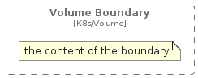 | [c4k8s/Boundary/VolumeBoundary](../../c4k8s/Boundary/VolumeBoundary.md) |

