# Element

The module contains 78 items.

| |Name|
|:---:|---|
|  | [c4k8s/Element/APIService](../../c4k8s/Element/APIService.md) |
| 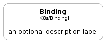 | [c4k8s/Element/Binding](../../c4k8s/Element/Binding.md) |
|  | [c4k8s/Element/CSIDriver](../../c4k8s/Element/CSIDriver.md) |
| 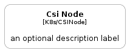 | [c4k8s/Element/CSINode](../../c4k8s/Element/CSINode.md) |
| 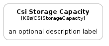 | [c4k8s/Element/CSIStorageCapacity](../../c4k8s/Element/CSIStorageCapacity.md) |
| 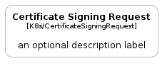 | [c4k8s/Element/CertificateSigningRequest](../../c4k8s/Element/CertificateSigningRequest.md) |
|  | [c4k8s/Element/Cluster](../../c4k8s/Element/Cluster.md) |
| 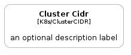 | [c4k8s/Element/ClusterCIDR](../../c4k8s/Element/ClusterCIDR.md) |
|  | [c4k8s/Element/ClusterRole](../../c4k8s/Element/ClusterRole.md) |
| 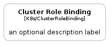 | [c4k8s/Element/ClusterRoleBinding](../../c4k8s/Element/ClusterRoleBinding.md) |
|  | [c4k8s/Element/ComponentStatus](../../c4k8s/Element/ComponentStatus.md) |
|  | [c4k8s/Element/ConfigMap](../../c4k8s/Element/ConfigMap.md) |
|  | [c4k8s/Element/ControllerRevision](../../c4k8s/Element/ControllerRevision.md) |
|  | [c4k8s/Element/CronJob](../../c4k8s/Element/CronJob.md) |
| 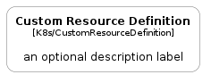 | [c4k8s/Element/CustomResourceDefinition](../../c4k8s/Element/CustomResourceDefinition.md) |
| 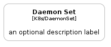 | [c4k8s/Element/DaemonSet](../../c4k8s/Element/DaemonSet.md) |
| 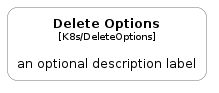 | [c4k8s/Element/DeleteOptions](../../c4k8s/Element/DeleteOptions.md) |
|  | [c4k8s/Element/Deployment](../../c4k8s/Element/Deployment.md) |
| 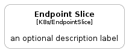 | [c4k8s/Element/EndpointSlice](../../c4k8s/Element/EndpointSlice.md) |
|  | [c4k8s/Element/Endpoints](../../c4k8s/Element/Endpoints.md) |
|  | [c4k8s/Element/Event](../../c4k8s/Element/Event.md) |
|  | [c4k8s/Element/FlowSchema](../../c4k8s/Element/FlowSchema.md) |
|  | [c4k8s/Element/HorizontalPodAutoscaler](../../c4k8s/Element/HorizontalPodAutoscaler.md) |
|  | [c4k8s/Element/Ingress](../../c4k8s/Element/Ingress.md) |
|  | [c4k8s/Element/IngressClass](../../c4k8s/Element/IngressClass.md) |
|  | [c4k8s/Element/Job](../../c4k8s/Element/Job.md) |
|  | [c4k8s/Element/LabelSelector](../../c4k8s/Element/LabelSelector.md) |
| 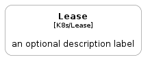 | [c4k8s/Element/Lease](../../c4k8s/Element/Lease.md) |
|  | [c4k8s/Element/LimitRange](../../c4k8s/Element/LimitRange.md) |
|  | [c4k8s/Element/ListMeta](../../c4k8s/Element/ListMeta.md) |
|  | [c4k8s/Element/LocalObjectReference](../../c4k8s/Element/LocalObjectReference.md) |
|  | [c4k8s/Element/LocalSubjectAccessReview](../../c4k8s/Element/LocalSubjectAccessReview.md) |
|  | [c4k8s/Element/MutatingWebhookConfiguration](../../c4k8s/Element/MutatingWebhookConfiguration.md) |
|  | [c4k8s/Element/Namespace](../../c4k8s/Element/Namespace.md) |
| 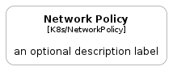 | [c4k8s/Element/NetworkPolicy](../../c4k8s/Element/NetworkPolicy.md) |
|  | [c4k8s/Element/Node](../../c4k8s/Element/Node.md) |
| 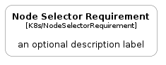 | [c4k8s/Element/NodeSelectorRequirement](../../c4k8s/Element/NodeSelectorRequirement.md) |
| 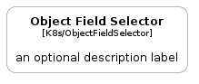 | [c4k8s/Element/ObjectFieldSelector](../../c4k8s/Element/ObjectFieldSelector.md) |
| 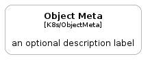 | [c4k8s/Element/ObjectMeta](../../c4k8s/Element/ObjectMeta.md) |
|  | [c4k8s/Element/ObjectReference](../../c4k8s/Element/ObjectReference.md) |
|  | [c4k8s/Element/Patch](../../c4k8s/Element/Patch.md) |
| 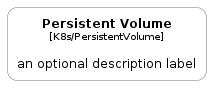 | [c4k8s/Element/PersistentVolume](../../c4k8s/Element/PersistentVolume.md) |
|  | [c4k8s/Element/PersistentVolumeClaim](../../c4k8s/Element/PersistentVolumeClaim.md) |
|  | [c4k8s/Element/Pod](../../c4k8s/Element/Pod.md) |
|  | [c4k8s/Element/PodDisruptionBudget](../../c4k8s/Element/PodDisruptionBudget.md) |
|  | [c4k8s/Element/PodScheduling](../../c4k8s/Element/PodScheduling.md) |
|  | [c4k8s/Element/PodTemplate](../../c4k8s/Element/PodTemplate.md) |
|  | [c4k8s/Element/PriorityClass](../../c4k8s/Element/PriorityClass.md) |
|  | [c4k8s/Element/PriorityLevelConfiguration](../../c4k8s/Element/PriorityLevelConfiguration.md) |
| 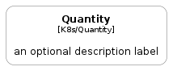 | [c4k8s/Element/Quantity](../../c4k8s/Element/Quantity.md) |
| 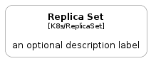 | [c4k8s/Element/ReplicaSet](../../c4k8s/Element/ReplicaSet.md) |
|  | [c4k8s/Element/ReplicationController](../../c4k8s/Element/ReplicationController.md) |
|  | [c4k8s/Element/ResourceClaim](../../c4k8s/Element/ResourceClaim.md) |
|  | [c4k8s/Element/ResourceClaimTemplate](../../c4k8s/Element/ResourceClaimTemplate.md) |
|  | [c4k8s/Element/ResourceClass](../../c4k8s/Element/ResourceClass.md) |
| 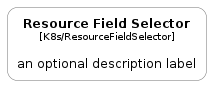 | [c4k8s/Element/ResourceFieldSelector](../../c4k8s/Element/ResourceFieldSelector.md) |
|  | [c4k8s/Element/ResourceQuota](../../c4k8s/Element/ResourceQuota.md) |
|  | [c4k8s/Element/Role](../../c4k8s/Element/Role.md) |
|  | [c4k8s/Element/RoleBinding](../../c4k8s/Element/RoleBinding.md) |
| 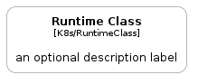 | [c4k8s/Element/RuntimeClass](../../c4k8s/Element/RuntimeClass.md) |
|  | [c4k8s/Element/Secret](../../c4k8s/Element/Secret.md) |
|  | [c4k8s/Element/SelfSubjectAccessReview](../../c4k8s/Element/SelfSubjectAccessReview.md) |
|  | [c4k8s/Element/SelfSubjectReview](../../c4k8s/Element/SelfSubjectReview.md) |
|  | [c4k8s/Element/SelfSubjectRulesReview](../../c4k8s/Element/SelfSubjectRulesReview.md) |
| 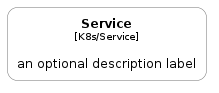 | [c4k8s/Element/Service](../../c4k8s/Element/Service.md) |
|  | [c4k8s/Element/ServiceAccount](../../c4k8s/Element/ServiceAccount.md) |
| 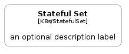 | [c4k8s/Element/StatefulSet](../../c4k8s/Element/StatefulSet.md) |
| 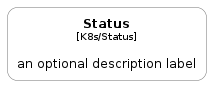 | [c4k8s/Element/Status](../../c4k8s/Element/Status.md) |
| 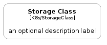 | [c4k8s/Element/StorageClass](../../c4k8s/Element/StorageClass.md) |
|  | [c4k8s/Element/SubjectAccessReview](../../c4k8s/Element/SubjectAccessReview.md) |
|  | [c4k8s/Element/TokenRequest](../../c4k8s/Element/TokenRequest.md) |
|  | [c4k8s/Element/TokenReview](../../c4k8s/Element/TokenReview.md) |
| 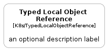 | [c4k8s/Element/TypedLocalObjectReference](../../c4k8s/Element/TypedLocalObjectReference.md) |
|  | [c4k8s/Element/ValidatingAdmissionPolicy](../../c4k8s/Element/ValidatingAdmissionPolicy.md) |
|  | [c4k8s/Element/ValidatingAdmissionPolicyBindingList](../../c4k8s/Element/ValidatingAdmissionPolicyBindingList.md) |
|  | [c4k8s/Element/ValidatingWebhookConfiguration](../../c4k8s/Element/ValidatingWebhookConfiguration.md) |
| 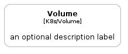 | [c4k8s/Element/Volume](../../c4k8s/Element/Volume.md) |
| 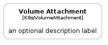 | [c4k8s/Element/VolumeAttachment](../../c4k8s/Element/VolumeAttachment.md) |

