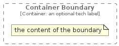
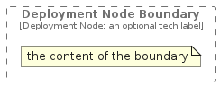
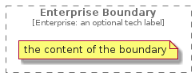

# Boundary

The module contains 4 items.

| |Name|
|:---:|---|
|  | [c4model/Boundary/ContainerBoundary](../../c4model/Boundary/ContainerBoundary.md) |
|  | [c4model/Boundary/DeploymentNodeBoundary](../../c4model/Boundary/DeploymentNodeBoundary.md) |
|  | [c4model/Boundary/EnterpriseBoundary](../../c4model/Boundary/EnterpriseBoundary.md) |
|  | [c4model/Boundary/SystemBoundary](../../c4model/Boundary/SystemBoundary.md) |

