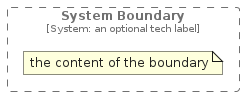

# SystemBoundary


```text
c4model/Boundary/SystemBoundary
```

```text
include('c4model/Boundary/SystemBoundary')
```


| SystemBoundary |
| :---: |
|  |


## SystemBoundary

### Load remotely
```plantuml
@startuml
' configures the library
!global $LIB_BASE_LOCATION="https://github.com/tmorin/plantuml-libs/distribution"

' loads the library's bootstrap
!include $LIB_BASE_LOCATION/bootstrap.puml

' loads the package bootstrap
include('c4model/bootstrap')

' loads the Item which embeds the element SystemBoundary
include('c4model/Boundary/SystemBoundary')

SystemBoundary('SystemBoundary', 'System Boundary', 'an optional tech label') {
  note as note
  the content of the boundary
  end note
}
@enduml
```

### Load locally
```plantuml
@startuml
' configures the library
!global $INCLUSION_MODE="local"
!global $LIB_BASE_LOCATION="../.."

' loads the library's bootstrap
!include $LIB_BASE_LOCATION/bootstrap.puml

' loads the package bootstrap
include('c4model/bootstrap')

' loads the Item which embeds the element SystemBoundary
include('c4model/Boundary/SystemBoundary')

SystemBoundary('SystemBoundary', 'System Boundary', 'an optional tech label') {
  note as note
  the content of the boundary
  end note
}
@enduml
```

