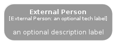

# ExternalPerson


```text
c4model/Element/ExternalPerson
```

```text
include('c4model/Element/ExternalPerson')
```


| ExternalPerson |
| :---: |
|  |


## ExternalPerson

### Load remotely
```plantuml
@startuml
' configures the library
!global $LIB_BASE_LOCATION="https://github.com/tmorin/plantuml-libs/distribution"

' loads the library's bootstrap
!include $LIB_BASE_LOCATION/bootstrap.puml

' loads the package bootstrap
include('c4model/bootstrap')

' loads the Item which embeds the element ExternalPerson
include('c4model/Element/ExternalPerson')

ExternalPerson('ExternalPerson', 'External Person', 'an optional description label', 'an optional tech label')
@enduml
```

### Load locally
```plantuml
@startuml
' configures the library
!global $INCLUSION_MODE="local"
!global $LIB_BASE_LOCATION="../.."

' loads the library's bootstrap
!include $LIB_BASE_LOCATION/bootstrap.puml

' loads the package bootstrap
include('c4model/bootstrap')

' loads the Item which embeds the element ExternalPerson
include('c4model/Element/ExternalPerson')

ExternalPerson('ExternalPerson', 'External Person', 'an optional description label', 'an optional tech label')
@enduml
```

