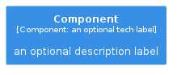
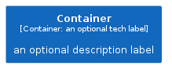
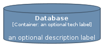
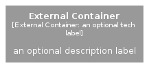
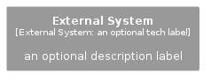
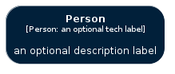
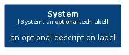

# Element

The module contains 8 items.

| |Name|
|:---:|---|
|  | [c4model/Element/Component](../../c4model/Element/Component.md) |
|  | [c4model/Element/Container](../../c4model/Element/Container.md) |
|  | [c4model/Element/Database](../../c4model/Element/Database.md) |
|  | [c4model/Element/ExternalContainer](../../c4model/Element/ExternalContainer.md) |
|  | [c4model/Element/ExternalPerson](../../c4model/Element/ExternalPerson.md) |
|  | [c4model/Element/ExternalSystem](../../c4model/Element/ExternalSystem.md) |
|  | [c4model/Element/Person](../../c4model/Element/Person.md) |
|  | [c4model/Element/System](../../c4model/Element/System.md) |

