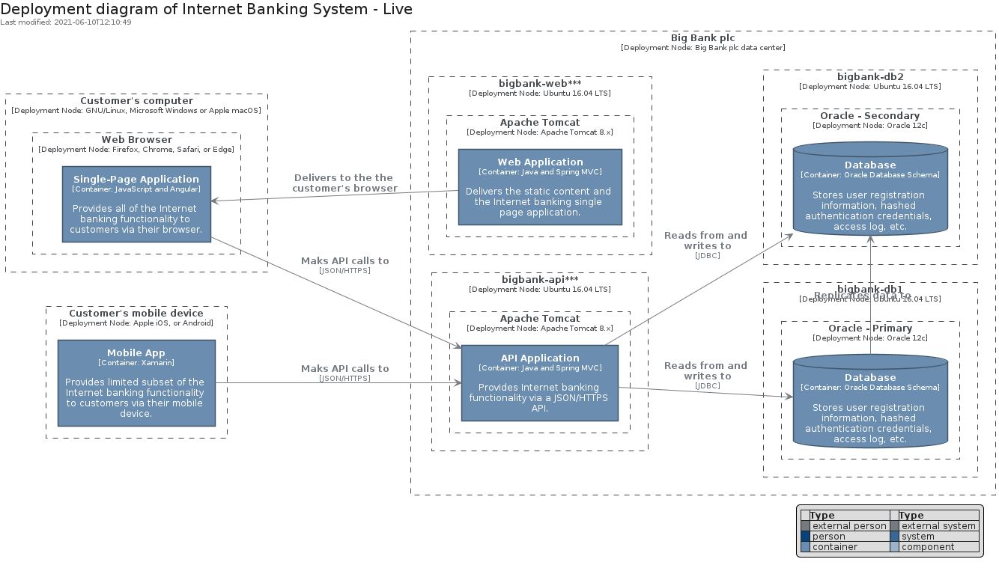
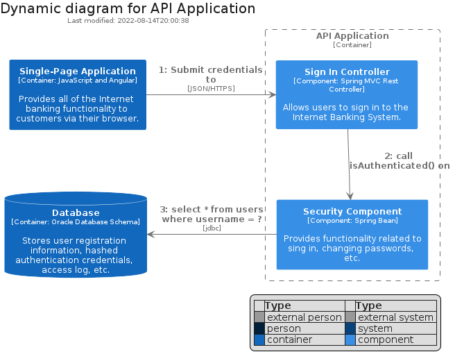
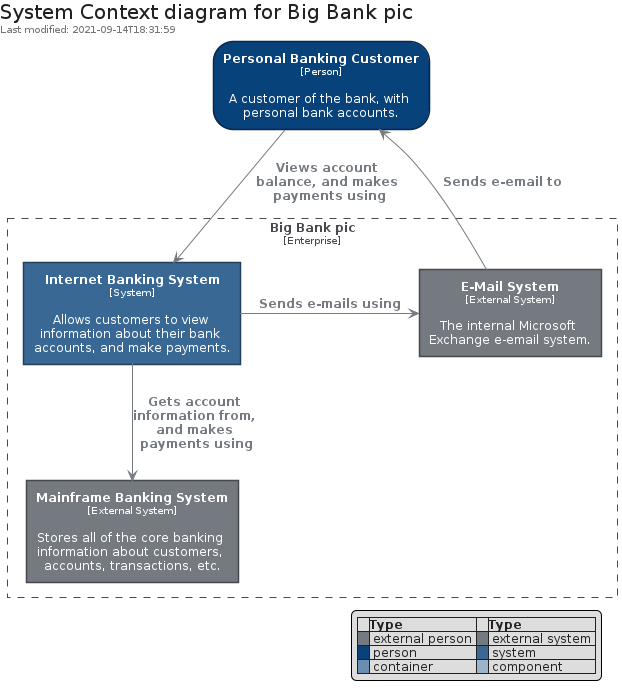
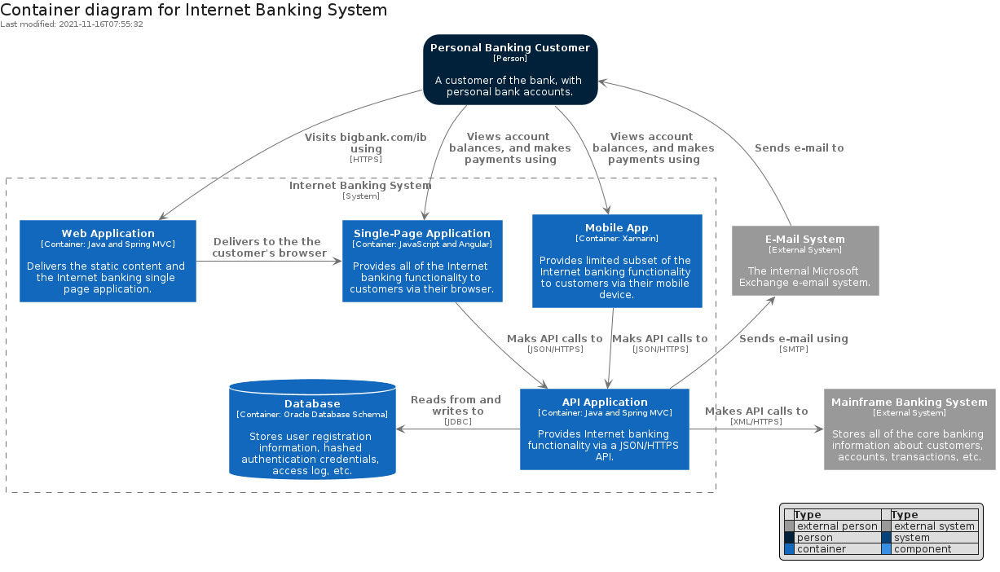
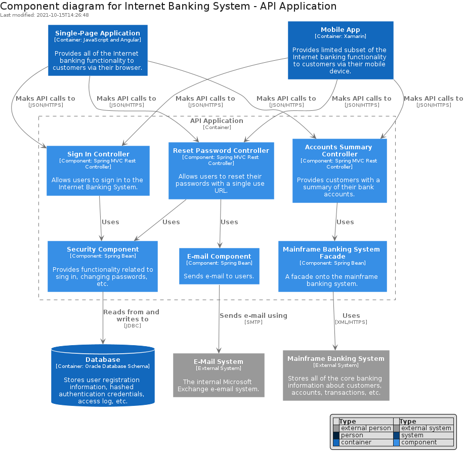
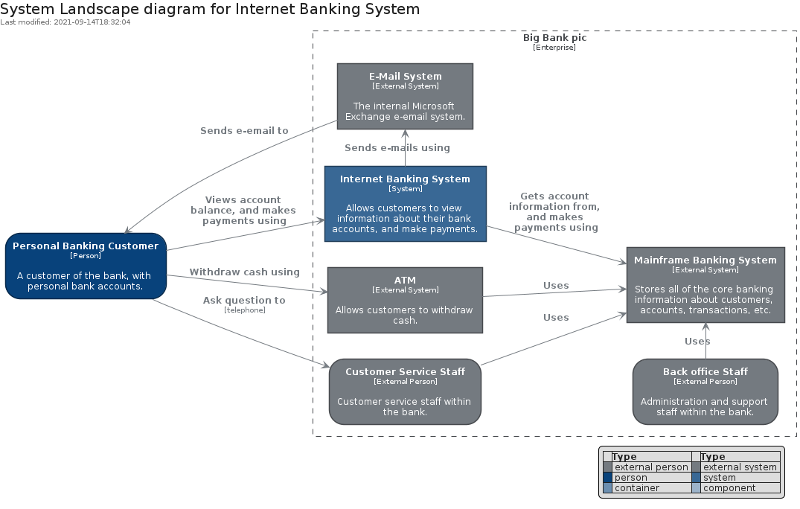
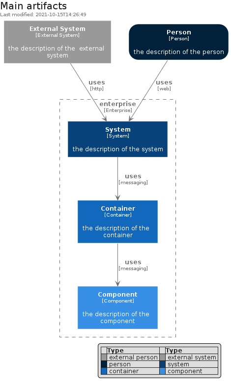

# c4model

## Presentation
This package implements `elements` and `boundaries` coming from the [C4 Model](https://c4model.com).

## Usage

### Bootstrap

The bootstrap may provide PlantUML artifacts like constants, procedures or style statements.

```plantuml
' loads the c4model bootstrap
include('c4model/bootstrap')
```

### Full inclusion

An additional include can be used to load all items in one shot.

 ```plantuml
' loads the bootstrap of `c4model` and all related items
include('c4model/full')
```

### Single inclusion

Finally, another include can be used to load the library's bootstrap, the package's bootstrap and all items' resources in one `!include` statement.

Include remotely the resources:
```plantuml
' loads the library, the bootstrap of `c4model` and all related items
!include https://raw.githubusercontent.com/tmorin/plantuml-libs/master/distribution/c4model/single.puml
```

Include locally the resources:
```plantuml
' configures the library
!global $INCLUSION_MODE="local"
' loads the library, the bootstrap of `c4model` and all related items
!include <the relative path to the /distribution directory>/c4model/single.puml
```


# Modules

The package provides 2 modules.

- [c4model/Element](../c4model/Element/README.md) with 10 items
- [c4model/Boundary](../c4model/Boundary/README.md) with 5 items


# Examples

The package provides 7 examples.

## Deployment diagram

<br>
[The source file.](../c4model/deployment_diagram.puml)

## Dynamic diagram

<br>
[The source file.](../c4model/dynamic_diagram.puml)

## Level 1 System Context

<br>
[The source file.](../c4model/level_1_system_context.puml)

## Level 2 Container

<br>
[The source file.](../c4model/level_2_container.puml)

## Level 3 Component

<br>
[The source file.](../c4model/level_3_component.puml)

## System Landscape diagram

<br>
[The source file.](../c4model/system_landscape_diagram.puml)

## Main Artifacts

<br>
[The source file.](../c4model/main_artifacts.puml)


