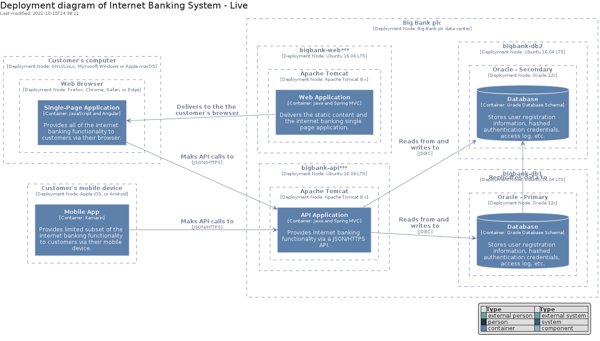
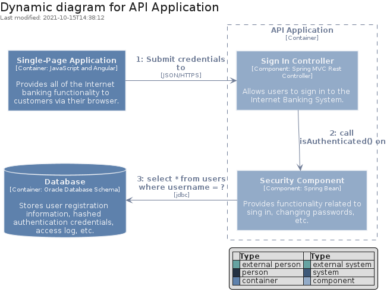
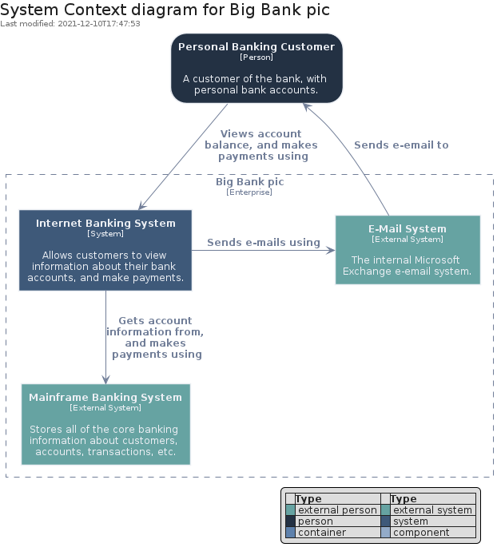
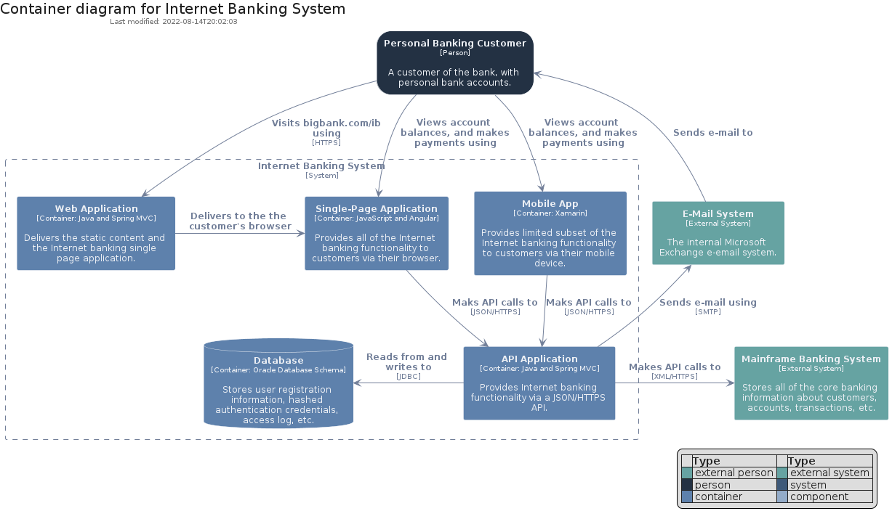
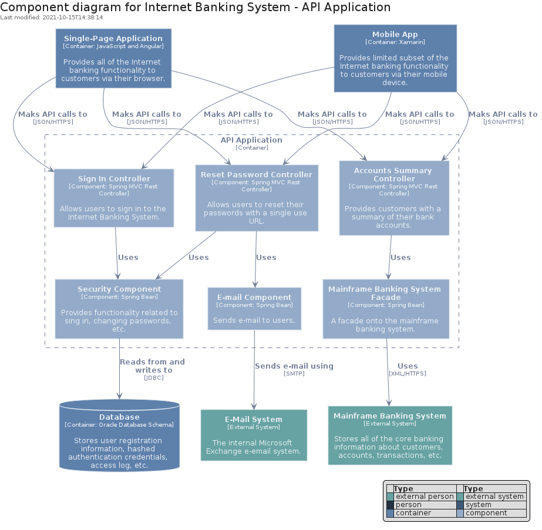
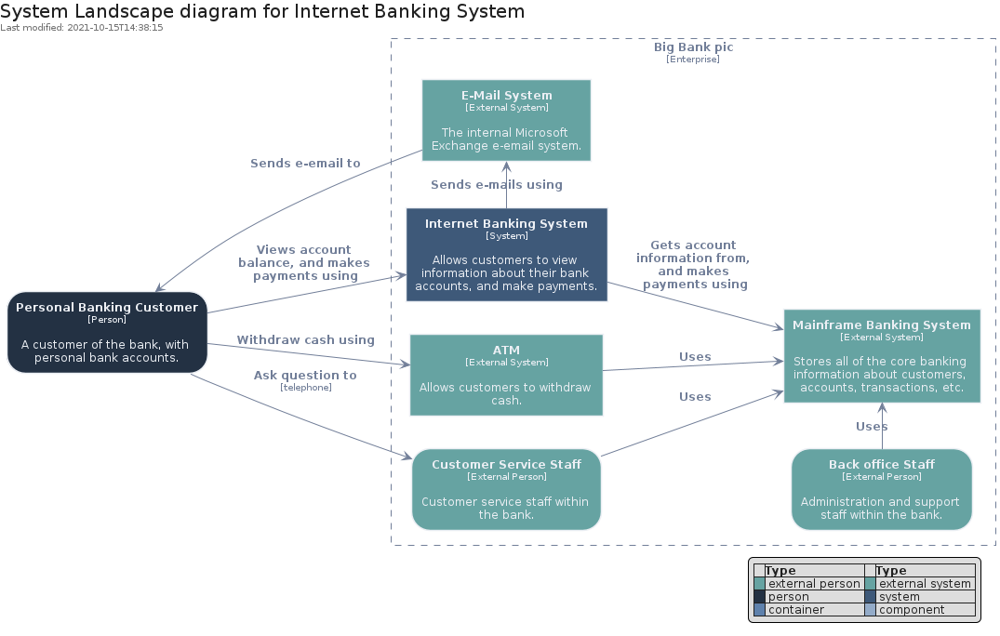
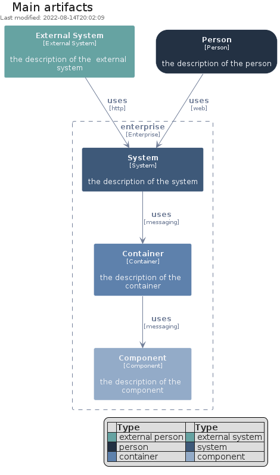

# c4nord

## Presentation
This package implements `elements` and `boundaries` coming from the [C4 Model](https://c4model.com) but with the [Nord Theme](https://www.nordtheme.com) flavor.

## Bootstrap

The bootstrap may provide PlantUML artifacts like constants, procedures or style statements.

```plantuml
' loads the c4nord bootstrap
include('c4nord/bootstrap')
```


# Modules

The package provides 0 modules.


# Examples

The package provides 7 examples.

## Deployment diagram

<br>
[The source file.](../c4nord/deployment_diagram.puml)

## Dynamic diagram

<br>
[The source file.](../c4nord/dynamic_diagram.puml)

## Level 1 System Context

<br>
[The source file.](../c4nord/level_1_system_context.puml)

## Level 2 Container

<br>
[The source file.](../c4nord/level_2_container.puml)

## Level 3 Component

<br>
[The source file.](../c4nord/level_3_component.puml)

## System Landscape diagram

<br>
[The source file.](../c4nord/system_landscape_diagram.puml)

## Main Artifacts

<br>
[The source file.](../c4nord/main_artifacts.puml)


