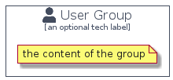

# User


```text
domainstorytelling/Actor/User
```

```text
include('domainstorytelling/Actor/User')
```


| Illustration | User | UserCard | UserGroup |
| :---: | :---: | :---: | :---: |
|  |  |  |  |


## User

### Load remotely
```plantuml
@startuml
' configures the library
!global $LIB_BASE_LOCATION="https://raw.githubusercontent.com/tmorin/plantuml-libs/master/distribution"

' loads the library's bootstrap
!include $LIB_BASE_LOCATION/bootstrap.puml

' loads the package bootstrap
include('domainstorytelling/bootstrap')

' loads the Item which embeds the element User
include('domainstorytelling/Actor/User')

' renders the element
User('User', 'User', 'an optional tech label')
@enduml
```

### Load locally
```plantuml
@startuml
' configures the library
!global $INCLUSION_MODE="local"
!global $LIB_BASE_LOCATION="../.."

' loads the library's bootstrap
!include $LIB_BASE_LOCATION/bootstrap.puml

' loads the package bootstrap
include('domainstorytelling/bootstrap')

' loads the Item which embeds the element User
include('domainstorytelling/Actor/User')

' renders the element
User('User', 'User', 'an optional tech label')
@enduml
```

## UserCard

### Load remotely
```plantuml
@startuml
' configures the library
!global $LIB_BASE_LOCATION="https://raw.githubusercontent.com/tmorin/plantuml-libs/master/distribution"

' loads the library's bootstrap
!include $LIB_BASE_LOCATION/bootstrap.puml

' loads the package bootstrap
include('domainstorytelling/bootstrap')

' loads the Item which embeds the element UserCard
include('domainstorytelling/Actor/User')

' renders the element
UserCard('UserCard', 'User Card', 'an optional description')
@enduml
```

### Load locally
```plantuml
@startuml
' configures the library
!global $INCLUSION_MODE="local"
!global $LIB_BASE_LOCATION="../.."

' loads the library's bootstrap
!include $LIB_BASE_LOCATION/bootstrap.puml

' loads the package bootstrap
include('domainstorytelling/bootstrap')

' loads the Item which embeds the element UserCard
include('domainstorytelling/Actor/User')

' renders the element
UserCard('UserCard', 'User Card', 'an optional description')
@enduml
```

## UserGroup

### Load remotely
```plantuml
@startuml
' configures the library
!global $LIB_BASE_LOCATION="https://raw.githubusercontent.com/tmorin/plantuml-libs/master/distribution"

' loads the library's bootstrap
!include $LIB_BASE_LOCATION/bootstrap.puml

' loads the package bootstrap
include('domainstorytelling/bootstrap')

' loads the Item which embeds the element UserGroup
include('domainstorytelling/Actor/User')

' renders the element
UserGroup('UserGroup', 'User Group', 'an optional tech label') {
    note as note
        the content of the group
    end note
}
@enduml
```

### Load locally
```plantuml
@startuml
' configures the library
!global $INCLUSION_MODE="local"
!global $LIB_BASE_LOCATION="../.."

' loads the library's bootstrap
!include $LIB_BASE_LOCATION/bootstrap.puml

' loads the package bootstrap
include('domainstorytelling/bootstrap')

' loads the Item which embeds the element UserGroup
include('domainstorytelling/Actor/User')

' renders the element
UserGroup('UserGroup', 'User Group', 'an optional tech label') {
    note as note
        the content of the group
    end note
}
@enduml
```

