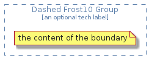

# DashedFrost10Group


```text
domainstorytelling/Group/DashedFrost10Group
```

```text
include('domainstorytelling/Group/DashedFrost10Group')
```


| DashedFrost10Group |
| :---: |
|  |


## DashedFrost10Group

### Load remotely
```plantuml
@startuml
' configures the library
!global $LIB_BASE_LOCATION="https://raw.githubusercontent.com/tmorin/plantuml-libs/master/distribution"

' loads the library's bootstrap
!include $LIB_BASE_LOCATION/bootstrap.puml

' loads the package bootstrap
include('domainstorytelling/bootstrap')

' loads the Item which embeds the element DashedFrost10Group
include('domainstorytelling/Group/DashedFrost10Group')

DashedFrost10Group('DashedFrost10Group', 'Dashed Frost10 Group', 'an optional tech label') {
  note as note
  the content of the boundary
  end note
}
@enduml
```

### Load locally
```plantuml
@startuml
' configures the library
!global $INCLUSION_MODE="local"
!global $LIB_BASE_LOCATION="../.."

' loads the library's bootstrap
!include $LIB_BASE_LOCATION/bootstrap.puml

' loads the package bootstrap
include('domainstorytelling/bootstrap')

' loads the Item which embeds the element DashedFrost10Group
include('domainstorytelling/Group/DashedFrost10Group')

DashedFrost10Group('DashedFrost10Group', 'Dashed Frost10 Group', 'an optional tech label') {
  note as note
  the content of the boundary
  end note
}
@enduml
```

