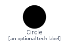
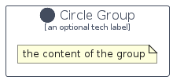

# Circle


```text
domainstorytelling/Object/Circle
```

```text
include('domainstorytelling/Object/Circle')
```


| Illustration | Circle | CircleCard | CircleGroup |
| :---: | :---: | :---: | :---: |
|  |  |  |  |


## Circle

### Load remotely
```plantuml
@startuml
' configures the library
!global $LIB_BASE_LOCATION="https://raw.githubusercontent.com/tmorin/plantuml-libs/master/distribution"

' loads the library's bootstrap
!include $LIB_BASE_LOCATION/bootstrap.puml

' loads the package bootstrap
include('domainstorytelling/bootstrap')

' loads the Item which embeds the element Circle
include('domainstorytelling/Object/Circle')

' renders the element
Circle('Circle', 'Circle', 'an optional tech label')
@enduml
```

### Load locally
```plantuml
@startuml
' configures the library
!global $INCLUSION_MODE="local"
!global $LIB_BASE_LOCATION="../.."

' loads the library's bootstrap
!include $LIB_BASE_LOCATION/bootstrap.puml

' loads the package bootstrap
include('domainstorytelling/bootstrap')

' loads the Item which embeds the element Circle
include('domainstorytelling/Object/Circle')

' renders the element
Circle('Circle', 'Circle', 'an optional tech label')
@enduml
```

## CircleCard

### Load remotely
```plantuml
@startuml
' configures the library
!global $LIB_BASE_LOCATION="https://raw.githubusercontent.com/tmorin/plantuml-libs/master/distribution"

' loads the library's bootstrap
!include $LIB_BASE_LOCATION/bootstrap.puml

' loads the package bootstrap
include('domainstorytelling/bootstrap')

' loads the Item which embeds the element CircleCard
include('domainstorytelling/Object/Circle')

' renders the element
CircleCard('CircleCard', 'Circle Card', 'an optional description')
@enduml
```

### Load locally
```plantuml
@startuml
' configures the library
!global $INCLUSION_MODE="local"
!global $LIB_BASE_LOCATION="../.."

' loads the library's bootstrap
!include $LIB_BASE_LOCATION/bootstrap.puml

' loads the package bootstrap
include('domainstorytelling/bootstrap')

' loads the Item which embeds the element CircleCard
include('domainstorytelling/Object/Circle')

' renders the element
CircleCard('CircleCard', 'Circle Card', 'an optional description')
@enduml
```

## CircleGroup

### Load remotely
```plantuml
@startuml
' configures the library
!global $LIB_BASE_LOCATION="https://raw.githubusercontent.com/tmorin/plantuml-libs/master/distribution"

' loads the library's bootstrap
!include $LIB_BASE_LOCATION/bootstrap.puml

' loads the package bootstrap
include('domainstorytelling/bootstrap')

' loads the Item which embeds the element CircleGroup
include('domainstorytelling/Object/Circle')

' renders the element
CircleGroup('CircleGroup', 'Circle Group', 'an optional tech label') {
    note as note
        the content of the group
    end note
}
@enduml
```

### Load locally
```plantuml
@startuml
' configures the library
!global $INCLUSION_MODE="local"
!global $LIB_BASE_LOCATION="../.."

' loads the library's bootstrap
!include $LIB_BASE_LOCATION/bootstrap.puml

' loads the package bootstrap
include('domainstorytelling/bootstrap')

' loads the Item which embeds the element CircleGroup
include('domainstorytelling/Object/Circle')

' renders the element
CircleGroup('CircleGroup', 'Circle Group', 'an optional tech label') {
    note as note
        the content of the group
    end note
}
@enduml
```

