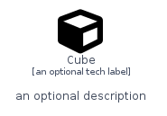
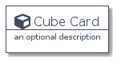
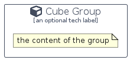

# Cube


```text
domainstorytelling/Object/Cube
```

```text
include('domainstorytelling/Object/Cube')
```


| Illustration | Cube | CubeCard | CubeGroup |
| :---: | :---: | :---: | :---: |
|  |  |  |  |


## Cube

### Load remotely
```plantuml
@startuml
' configures the library
!global $LIB_BASE_LOCATION="https://github.com/tmorin/plantuml-libs/distribution"

' loads the library's bootstrap
!include $LIB_BASE_LOCATION/bootstrap.puml

' loads the package bootstrap
include('domainstorytelling/bootstrap')

' loads the Item which embeds the element Cube
include('domainstorytelling/Object/Cube')

' renders the element
Cube('Cube', 'Cube', 'an optional tech label')
@enduml
```

### Load locally
```plantuml
@startuml
' configures the library
!global $INCLUSION_MODE="local"
!global $LIB_BASE_LOCATION="../.."

' loads the library's bootstrap
!include $LIB_BASE_LOCATION/bootstrap.puml

' loads the package bootstrap
include('domainstorytelling/bootstrap')

' loads the Item which embeds the element Cube
include('domainstorytelling/Object/Cube')

' renders the element
Cube('Cube', 'Cube', 'an optional tech label')
@enduml
```

## CubeCard

### Load remotely
```plantuml
@startuml
' configures the library
!global $LIB_BASE_LOCATION="https://github.com/tmorin/plantuml-libs/distribution"

' loads the library's bootstrap
!include $LIB_BASE_LOCATION/bootstrap.puml

' loads the package bootstrap
include('domainstorytelling/bootstrap')

' loads the Item which embeds the element CubeCard
include('domainstorytelling/Object/Cube')

' renders the element
CubeCard('CubeCard', 'Cube Card', 'an optional description')
@enduml
```

### Load locally
```plantuml
@startuml
' configures the library
!global $INCLUSION_MODE="local"
!global $LIB_BASE_LOCATION="../.."

' loads the library's bootstrap
!include $LIB_BASE_LOCATION/bootstrap.puml

' loads the package bootstrap
include('domainstorytelling/bootstrap')

' loads the Item which embeds the element CubeCard
include('domainstorytelling/Object/Cube')

' renders the element
CubeCard('CubeCard', 'Cube Card', 'an optional description')
@enduml
```

## CubeGroup

### Load remotely
```plantuml
@startuml
' configures the library
!global $LIB_BASE_LOCATION="https://github.com/tmorin/plantuml-libs/distribution"

' loads the library's bootstrap
!include $LIB_BASE_LOCATION/bootstrap.puml

' loads the package bootstrap
include('domainstorytelling/bootstrap')

' loads the Item which embeds the element CubeGroup
include('domainstorytelling/Object/Cube')

' renders the element
CubeGroup('CubeGroup', 'Cube Group', 'an optional tech label') {
    note as note
        the content of the group
    end note
}
@enduml
```

### Load locally
```plantuml
@startuml
' configures the library
!global $INCLUSION_MODE="local"
!global $LIB_BASE_LOCATION="../.."

' loads the library's bootstrap
!include $LIB_BASE_LOCATION/bootstrap.puml

' loads the package bootstrap
include('domainstorytelling/bootstrap')

' loads the Item which embeds the element CubeGroup
include('domainstorytelling/Object/Cube')

' renders the element
CubeGroup('CubeGroup', 'Cube Group', 'an optional tech label') {
    note as note
        the content of the group
    end note
}
@enduml
```

