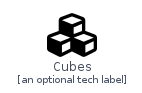
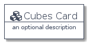
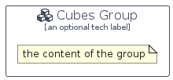

# Cubes


```text
domainstorytelling/Object/Cubes
```

```text
include('domainstorytelling/Object/Cubes')
```


| Illustration | Cubes | CubesCard | CubesGroup |
| :---: | :---: | :---: | :---: |
|  |  |  |  |


## Cubes

### Load remotely
```plantuml
@startuml
' configures the library
!global $LIB_BASE_LOCATION="https://raw.githubusercontent.com/tmorin/plantuml-libs/master/distribution"

' loads the library's bootstrap
!include $LIB_BASE_LOCATION/bootstrap.puml

' loads the package bootstrap
include('domainstorytelling/bootstrap')

' loads the Item which embeds the element Cubes
include('domainstorytelling/Object/Cubes')

' renders the element
Cubes('Cubes', 'Cubes', 'an optional tech label')
@enduml
```

### Load locally
```plantuml
@startuml
' configures the library
!global $INCLUSION_MODE="local"
!global $LIB_BASE_LOCATION="../.."

' loads the library's bootstrap
!include $LIB_BASE_LOCATION/bootstrap.puml

' loads the package bootstrap
include('domainstorytelling/bootstrap')

' loads the Item which embeds the element Cubes
include('domainstorytelling/Object/Cubes')

' renders the element
Cubes('Cubes', 'Cubes', 'an optional tech label')
@enduml
```

## CubesCard

### Load remotely
```plantuml
@startuml
' configures the library
!global $LIB_BASE_LOCATION="https://raw.githubusercontent.com/tmorin/plantuml-libs/master/distribution"

' loads the library's bootstrap
!include $LIB_BASE_LOCATION/bootstrap.puml

' loads the package bootstrap
include('domainstorytelling/bootstrap')

' loads the Item which embeds the element CubesCard
include('domainstorytelling/Object/Cubes')

' renders the element
CubesCard('CubesCard', 'Cubes Card', 'an optional description')
@enduml
```

### Load locally
```plantuml
@startuml
' configures the library
!global $INCLUSION_MODE="local"
!global $LIB_BASE_LOCATION="../.."

' loads the library's bootstrap
!include $LIB_BASE_LOCATION/bootstrap.puml

' loads the package bootstrap
include('domainstorytelling/bootstrap')

' loads the Item which embeds the element CubesCard
include('domainstorytelling/Object/Cubes')

' renders the element
CubesCard('CubesCard', 'Cubes Card', 'an optional description')
@enduml
```

## CubesGroup

### Load remotely
```plantuml
@startuml
' configures the library
!global $LIB_BASE_LOCATION="https://raw.githubusercontent.com/tmorin/plantuml-libs/master/distribution"

' loads the library's bootstrap
!include $LIB_BASE_LOCATION/bootstrap.puml

' loads the package bootstrap
include('domainstorytelling/bootstrap')

' loads the Item which embeds the element CubesGroup
include('domainstorytelling/Object/Cubes')

' renders the element
CubesGroup('CubesGroup', 'Cubes Group', 'an optional tech label') {
    note as note
        the content of the group
    end note
}
@enduml
```

### Load locally
```plantuml
@startuml
' configures the library
!global $INCLUSION_MODE="local"
!global $LIB_BASE_LOCATION="../.."

' loads the library's bootstrap
!include $LIB_BASE_LOCATION/bootstrap.puml

' loads the package bootstrap
include('domainstorytelling/bootstrap')

' loads the Item which embeds the element CubesGroup
include('domainstorytelling/Object/Cubes')

' renders the element
CubesGroup('CubesGroup', 'Cubes Group', 'an optional tech label') {
    note as note
        the content of the group
    end note
}
@enduml
```

