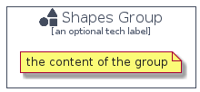

# Shapes


```text
domainstorytelling/Object/Shapes
```

```text
include('domainstorytelling/Object/Shapes')
```


| Illustration | Shapes | ShapesCard | ShapesGroup |
| :---: | :---: | :---: | :---: |
|  |  |  |  |


## Shapes

### Load remotely
```plantuml
@startuml
' configures the library
!global $LIB_BASE_LOCATION="https://raw.githubusercontent.com/tmorin/plantuml-libs/master/distribution"

' loads the library's bootstrap
!include $LIB_BASE_LOCATION/bootstrap.puml

' loads the package bootstrap
include('domainstorytelling/bootstrap')

' loads the Item which embeds the element Shapes
include('domainstorytelling/Object/Shapes')

' renders the element
Shapes('Shapes', 'Shapes', 'an optional tech label', 'an optional description')
@enduml
```

### Load locally
```plantuml
@startuml
' configures the library
!global $INCLUSION_MODE="local"
!global $LIB_BASE_LOCATION="../.."

' loads the library's bootstrap
!include $LIB_BASE_LOCATION/bootstrap.puml

' loads the package bootstrap
include('domainstorytelling/bootstrap')

' loads the Item which embeds the element Shapes
include('domainstorytelling/Object/Shapes')

' renders the element
Shapes('Shapes', 'Shapes', 'an optional tech label', 'an optional description')
@enduml
```

## ShapesCard

### Load remotely
```plantuml
@startuml
' configures the library
!global $LIB_BASE_LOCATION="https://raw.githubusercontent.com/tmorin/plantuml-libs/master/distribution"

' loads the library's bootstrap
!include $LIB_BASE_LOCATION/bootstrap.puml

' loads the package bootstrap
include('domainstorytelling/bootstrap')

' loads the Item which embeds the element ShapesCard
include('domainstorytelling/Object/Shapes')

' renders the element
ShapesCard('ShapesCard', 'Shapes Card', 'an optional description')
@enduml
```

### Load locally
```plantuml
@startuml
' configures the library
!global $INCLUSION_MODE="local"
!global $LIB_BASE_LOCATION="../.."

' loads the library's bootstrap
!include $LIB_BASE_LOCATION/bootstrap.puml

' loads the package bootstrap
include('domainstorytelling/bootstrap')

' loads the Item which embeds the element ShapesCard
include('domainstorytelling/Object/Shapes')

' renders the element
ShapesCard('ShapesCard', 'Shapes Card', 'an optional description')
@enduml
```

## ShapesGroup

### Load remotely
```plantuml
@startuml
' configures the library
!global $LIB_BASE_LOCATION="https://raw.githubusercontent.com/tmorin/plantuml-libs/master/distribution"

' loads the library's bootstrap
!include $LIB_BASE_LOCATION/bootstrap.puml

' loads the package bootstrap
include('domainstorytelling/bootstrap')

' loads the Item which embeds the element ShapesGroup
include('domainstorytelling/Object/Shapes')

' renders the element
ShapesGroup('ShapesGroup', 'Shapes Group', 'an optional tech label') {
    note as note
        the content of the group
    end note
}
@enduml
```

### Load locally
```plantuml
@startuml
' configures the library
!global $INCLUSION_MODE="local"
!global $LIB_BASE_LOCATION="../.."

' loads the library's bootstrap
!include $LIB_BASE_LOCATION/bootstrap.puml

' loads the package bootstrap
include('domainstorytelling/bootstrap')

' loads the Item which embeds the element ShapesGroup
include('domainstorytelling/Object/Shapes')

' renders the element
ShapesGroup('ShapesGroup', 'Shapes Group', 'an optional tech label') {
    note as note
        the content of the group
    end note
}
@enduml
```

