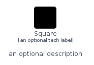
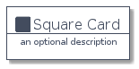
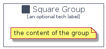

# Square


```text
domainstorytelling/Object/Square
```

```text
include('domainstorytelling/Object/Square')
```


| Illustration | Square | SquareCard | SquareGroup |
| :---: | :---: | :---: | :---: |
|  |  |  |  |


## Square

### Load remotely
```plantuml
@startuml
' configures the library
!global $LIB_BASE_LOCATION="https://raw.githubusercontent.com/tmorin/plantuml-libs/master/distribution"

' loads the library's bootstrap
!include $LIB_BASE_LOCATION/bootstrap.puml

' loads the package bootstrap
include('domainstorytelling/bootstrap')

' loads the Item which embeds the element Square
include('domainstorytelling/Object/Square')

' renders the element
Square('Square', 'Square', 'an optional tech label', 'an optional description')
@enduml
```

### Load locally
```plantuml
@startuml
' configures the library
!global $INCLUSION_MODE="local"
!global $LIB_BASE_LOCATION="../.."

' loads the library's bootstrap
!include $LIB_BASE_LOCATION/bootstrap.puml

' loads the package bootstrap
include('domainstorytelling/bootstrap')

' loads the Item which embeds the element Square
include('domainstorytelling/Object/Square')

' renders the element
Square('Square', 'Square', 'an optional tech label', 'an optional description')
@enduml
```

## SquareCard

### Load remotely
```plantuml
@startuml
' configures the library
!global $LIB_BASE_LOCATION="https://raw.githubusercontent.com/tmorin/plantuml-libs/master/distribution"

' loads the library's bootstrap
!include $LIB_BASE_LOCATION/bootstrap.puml

' loads the package bootstrap
include('domainstorytelling/bootstrap')

' loads the Item which embeds the element SquareCard
include('domainstorytelling/Object/Square')

' renders the element
SquareCard('SquareCard', 'Square Card', 'an optional description')
@enduml
```

### Load locally
```plantuml
@startuml
' configures the library
!global $INCLUSION_MODE="local"
!global $LIB_BASE_LOCATION="../.."

' loads the library's bootstrap
!include $LIB_BASE_LOCATION/bootstrap.puml

' loads the package bootstrap
include('domainstorytelling/bootstrap')

' loads the Item which embeds the element SquareCard
include('domainstorytelling/Object/Square')

' renders the element
SquareCard('SquareCard', 'Square Card', 'an optional description')
@enduml
```

## SquareGroup

### Load remotely
```plantuml
@startuml
' configures the library
!global $LIB_BASE_LOCATION="https://raw.githubusercontent.com/tmorin/plantuml-libs/master/distribution"

' loads the library's bootstrap
!include $LIB_BASE_LOCATION/bootstrap.puml

' loads the package bootstrap
include('domainstorytelling/bootstrap')

' loads the Item which embeds the element SquareGroup
include('domainstorytelling/Object/Square')

' renders the element
SquareGroup('SquareGroup', 'Square Group', 'an optional tech label') {
    note as note
        the content of the group
    end note
}
@enduml
```

### Load locally
```plantuml
@startuml
' configures the library
!global $INCLUSION_MODE="local"
!global $LIB_BASE_LOCATION="../.."

' loads the library's bootstrap
!include $LIB_BASE_LOCATION/bootstrap.puml

' loads the package bootstrap
include('domainstorytelling/bootstrap')

' loads the Item which embeds the element SquareGroup
include('domainstorytelling/Object/Square')

' renders the element
SquareGroup('SquareGroup', 'Square Group', 'an optional tech label') {
    note as note
        the content of the group
    end note
}
@enduml
```

