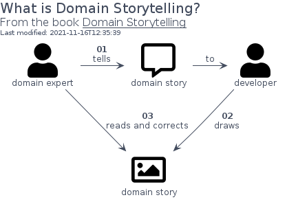
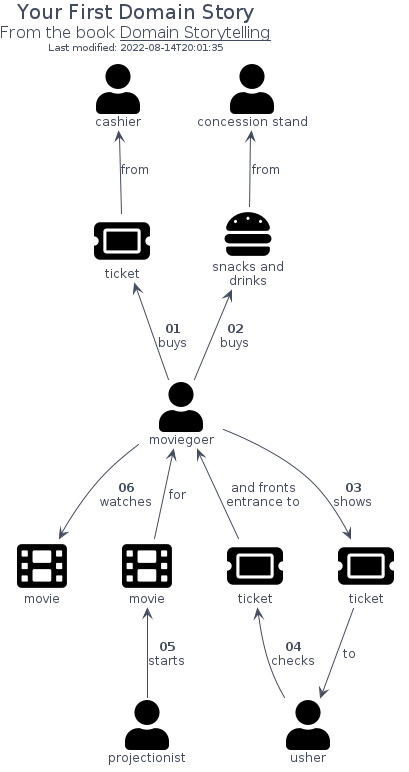
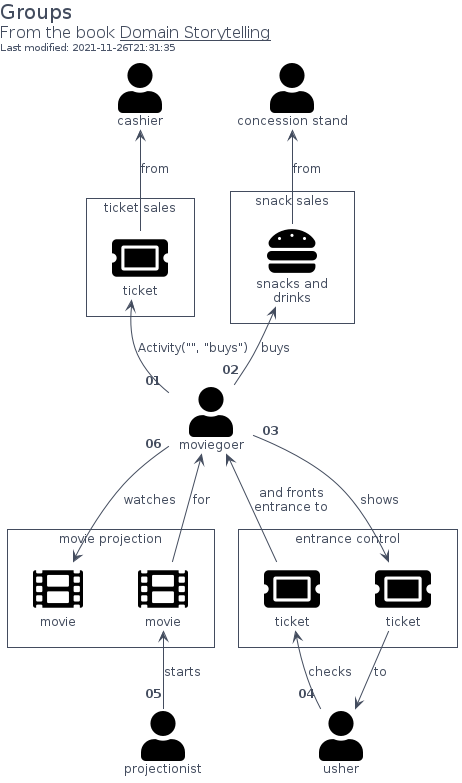

# domainstorytelling

## Presentation

This package implements the notation provided in [Domain Storytelling](https://domainstorytelling.org/).

The current icons comes from [Font Awesome](https://github.com/FortAwesome/Font-Awesome).
However, elements of all other packages (aws, fontawesome, material ...) can be simply included and used.

## Activity

Domain Storytelling defines the artifacts between actors and work objects as activities.
In PlantUML world, it basically the `Arrow`, i.e. `-->`, `.l.>`, ...

However, the text related to an activity must follow a specific format with an optional _sequence number_ and a _label_.
The procedure `Activity` can be used to follow the format.
The procedure can be used according to two fashions.

The first one is when the sequence number and the label are parts of the Arrow's text.
```plantuml
Actor("consumer", "consumer")
Actor("stand", "concession stand attendant")
Shapes("popcorn")
consumer --> popcorn : Activity("01", "orders")
popcorn --> stand : Activity("", "from")
```

The second one is when the sequence number is set as a _cardinality_ of the actor and the label is the Arrow's text.
```plantuml
Actor("consumer", "consumer")
Actor("stand", "concession stand attendant")
Shapes("popcorn")
consumer Activity("01") --> popcorn : orders
popcorn --> stand : from
```

## Bootstrap

The bootstrap may provide PlantUML artifacts like constants, procedures or style statements.

```plantuml
' loads the domainstorytelling bootstrap
include('domainstorytelling/bootstrap')
```


# Modules

The package provides 3 modules.

- [domainstorytelling/Actor](../domainstorytelling/Actor/README.md) with 2 items
- [domainstorytelling/Object](../domainstorytelling/Object/README.md) with 5 items
- [domainstorytelling/Group](../domainstorytelling/Group/README.md) with 21 items


# Examples

The package provides 3 examples.

## Introduction 1

<br>
[The source file.](../domainstorytelling/introduction_1.puml)

## Introduction 2

<br>
[The source file.](../domainstorytelling/introduction_2.puml)

## Groups

<br>
[The source file.](../domainstorytelling/groups.puml)


