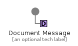
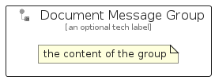

# DocumentMessage


```text
eip-1/MessageConstruction/DocumentMessage
```

```text
include('eip-1/MessageConstruction/DocumentMessage')
```


| Illustration | DocumentMessage | DocumentMessageGroup |
| :---: | :---: | :---: |
|  |  |  |


## Sprites
The item provides the following sriptes:

- `<$DocumentMessageXs>`
- `<$DocumentMessageSm>`
- `<$DocumentMessageMd>`
- `<$DocumentMessageLg>`


## DocumentMessage

### Load remotely
```plantuml
@startuml
' configures the library
!global $LIB_BASE_LOCATION="https://raw.githubusercontent.com/tmorin/plantuml-libs/master/distribution"

' loads the library's bootstrap
!include $LIB_BASE_LOCATION/bootstrap.puml

' loads the package bootstrap
include('eip-1/bootstrap')

' loads the Item which embeds the element DocumentMessage
include('eip-1/MessageConstruction/DocumentMessage')

' renders the element
DocumentMessage('DocumentMessage', 'Document Message', 'an optional tech label', 'an optional description')
@enduml
```

### Load locally
```plantuml
@startuml
' configures the library
!global $INCLUSION_MODE="local"
!global $LIB_BASE_LOCATION="../.."

' loads the library's bootstrap
!include $LIB_BASE_LOCATION/bootstrap.puml

' loads the package bootstrap
include('eip-1/bootstrap')

' loads the Item which embeds the element DocumentMessage
include('eip-1/MessageConstruction/DocumentMessage')

' renders the element
DocumentMessage('DocumentMessage', 'Document Message', 'an optional tech label', 'an optional description')
@enduml
```

## DocumentMessageGroup

### Load remotely
```plantuml
@startuml
' configures the library
!global $LIB_BASE_LOCATION="https://raw.githubusercontent.com/tmorin/plantuml-libs/master/distribution"

' loads the library's bootstrap
!include $LIB_BASE_LOCATION/bootstrap.puml

' loads the package bootstrap
include('eip-1/bootstrap')

' loads the Item which embeds the element DocumentMessageGroup
include('eip-1/MessageConstruction/DocumentMessage')

' renders the element
DocumentMessageGroup('DocumentMessageGroup', 'Document Message Group', 'an optional tech label') {
    note as note
        the content of the group
    end note
}
@enduml
```

### Load locally
```plantuml
@startuml
' configures the library
!global $INCLUSION_MODE="local"
!global $LIB_BASE_LOCATION="../.."

' loads the library's bootstrap
!include $LIB_BASE_LOCATION/bootstrap.puml

' loads the package bootstrap
include('eip-1/bootstrap')

' loads the Item which embeds the element DocumentMessageGroup
include('eip-1/MessageConstruction/DocumentMessage')

' renders the element
DocumentMessageGroup('DocumentMessageGroup', 'Document Message Group', 'an optional tech label') {
    note as note
        the content of the group
    end note
}
@enduml
```

