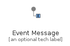
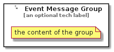

# EventMessage


```text
eip-1/MessageConstruction/EventMessage
```

```text
include('eip-1/MessageConstruction/EventMessage')
```


| Illustration | EventMessage | EventMessageGroup |
| :---: | :---: | :---: |
|  |  |  |


## EventMessage

### Load remotely
```plantuml
@startuml
' configures the library
!global $LIB_BASE_LOCATION="https://raw.githubusercontent.com/tmorin/plantuml-libs/master/distribution"

' loads the library's bootstrap
!include $LIB_BASE_LOCATION/bootstrap.puml

' loads the package bootstrap
include('eip-1/bootstrap')

' loads the Item which embeds the element EventMessage
include('eip-1/MessageConstruction/EventMessage')

' renders the element
EventMessage('EventMessage', 'Event Message', 'an optional tech label', 'an optional description')
@enduml
```

### Load locally
```plantuml
@startuml
' configures the library
!global $INCLUSION_MODE="local"
!global $LIB_BASE_LOCATION="../.."

' loads the library's bootstrap
!include $LIB_BASE_LOCATION/bootstrap.puml

' loads the package bootstrap
include('eip-1/bootstrap')

' loads the Item which embeds the element EventMessage
include('eip-1/MessageConstruction/EventMessage')

' renders the element
EventMessage('EventMessage', 'Event Message', 'an optional tech label', 'an optional description')
@enduml
```

## EventMessageGroup

### Load remotely
```plantuml
@startuml
' configures the library
!global $LIB_BASE_LOCATION="https://raw.githubusercontent.com/tmorin/plantuml-libs/master/distribution"

' loads the library's bootstrap
!include $LIB_BASE_LOCATION/bootstrap.puml

' loads the package bootstrap
include('eip-1/bootstrap')

' loads the Item which embeds the element EventMessageGroup
include('eip-1/MessageConstruction/EventMessage')

' renders the element
EventMessageGroup('EventMessageGroup', 'Event Message Group', 'an optional tech label') {
    note as note
        the content of the group
    end note
}
@enduml
```

### Load locally
```plantuml
@startuml
' configures the library
!global $INCLUSION_MODE="local"
!global $LIB_BASE_LOCATION="../.."

' loads the library's bootstrap
!include $LIB_BASE_LOCATION/bootstrap.puml

' loads the package bootstrap
include('eip-1/bootstrap')

' loads the Item which embeds the element EventMessageGroup
include('eip-1/MessageConstruction/EventMessage')

' renders the element
EventMessageGroup('EventMessageGroup', 'Event Message Group', 'an optional tech label') {
    note as note
        the content of the group
    end note
}
@enduml
```

