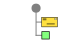

# MessageReturnAddress


```text
eip-1/MessageConstruction/MessageReturnAddress
```

```text
include('eip-1/MessageConstruction/MessageReturnAddress')
```


| Illustration | MessageReturnAddress | MessageReturnAddressGroup |
| :---: | :---: | :---: |
|  |  |  |


## MessageReturnAddress

### Load remotely
```plantuml
@startuml
' configures the library
!global $LIB_BASE_LOCATION="https://raw.githubusercontent.com/tmorin/plantuml-libs/master/distribution"

' loads the library's bootstrap
!include $LIB_BASE_LOCATION/bootstrap.puml

' loads the package bootstrap
include('eip-1/bootstrap')

' loads the Item which embeds the element MessageReturnAddress
include('eip-1/MessageConstruction/MessageReturnAddress')

' renders the element
MessageReturnAddress('MessageReturnAddress', 'Message Return Address', 'an optional tech label')
@enduml
```

### Load locally
```plantuml
@startuml
' configures the library
!global $INCLUSION_MODE="local"
!global $LIB_BASE_LOCATION="../.."

' loads the library's bootstrap
!include $LIB_BASE_LOCATION/bootstrap.puml

' loads the package bootstrap
include('eip-1/bootstrap')

' loads the Item which embeds the element MessageReturnAddress
include('eip-1/MessageConstruction/MessageReturnAddress')

' renders the element
MessageReturnAddress('MessageReturnAddress', 'Message Return Address', 'an optional tech label')
@enduml
```

## MessageReturnAddressGroup

### Load remotely
```plantuml
@startuml
' configures the library
!global $LIB_BASE_LOCATION="https://raw.githubusercontent.com/tmorin/plantuml-libs/master/distribution"

' loads the library's bootstrap
!include $LIB_BASE_LOCATION/bootstrap.puml

' loads the package bootstrap
include('eip-1/bootstrap')

' loads the Item which embeds the element MessageReturnAddressGroup
include('eip-1/MessageConstruction/MessageReturnAddress')

' renders the element
MessageReturnAddressGroup('MessageReturnAddressGroup', 'Message Return Address Group', 'an optional tech label') {
    note as note
        the content of the group
    end note
}
@enduml
```

### Load locally
```plantuml
@startuml
' configures the library
!global $INCLUSION_MODE="local"
!global $LIB_BASE_LOCATION="../.."

' loads the library's bootstrap
!include $LIB_BASE_LOCATION/bootstrap.puml

' loads the package bootstrap
include('eip-1/bootstrap')

' loads the Item which embeds the element MessageReturnAddressGroup
include('eip-1/MessageConstruction/MessageReturnAddress')

' renders the element
MessageReturnAddressGroup('MessageReturnAddressGroup', 'Message Return Address Group', 'an optional tech label') {
    note as note
        the content of the group
    end note
}
@enduml
```

