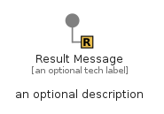

# ResultMessage


```text
eip-1/MessageConstruction/ResultMessage
```

```text
include('eip-1/MessageConstruction/ResultMessage')
```


| Illustration | ResultMessage | ResultMessageGroup |
| :---: | :---: | :---: |
|  |  |  |


## Sprites
The item provides the following sriptes:

- `<$ResultMessageXs>`
- `<$ResultMessageSm>`
- `<$ResultMessageMd>`
- `<$ResultMessageLg>`


## ResultMessage

### Load remotely
```plantuml
@startuml
' configures the library
!global $LIB_BASE_LOCATION="https://raw.githubusercontent.com/tmorin/plantuml-libs/master/distribution"

' loads the library's bootstrap
!include $LIB_BASE_LOCATION/bootstrap.puml

' loads the package bootstrap
include('eip-1/bootstrap')

' loads the Item which embeds the element ResultMessage
include('eip-1/MessageConstruction/ResultMessage')

' renders the element
ResultMessage('ResultMessage', 'Result Message', 'an optional tech label', 'an optional description')
@enduml
```

### Load locally
```plantuml
@startuml
' configures the library
!global $INCLUSION_MODE="local"
!global $LIB_BASE_LOCATION="../.."

' loads the library's bootstrap
!include $LIB_BASE_LOCATION/bootstrap.puml

' loads the package bootstrap
include('eip-1/bootstrap')

' loads the Item which embeds the element ResultMessage
include('eip-1/MessageConstruction/ResultMessage')

' renders the element
ResultMessage('ResultMessage', 'Result Message', 'an optional tech label', 'an optional description')
@enduml
```

## ResultMessageGroup

### Load remotely
```plantuml
@startuml
' configures the library
!global $LIB_BASE_LOCATION="https://raw.githubusercontent.com/tmorin/plantuml-libs/master/distribution"

' loads the library's bootstrap
!include $LIB_BASE_LOCATION/bootstrap.puml

' loads the package bootstrap
include('eip-1/bootstrap')

' loads the Item which embeds the element ResultMessageGroup
include('eip-1/MessageConstruction/ResultMessage')

' renders the element
ResultMessageGroup('ResultMessageGroup', 'Result Message Group', 'an optional tech label') {
    note as note
        the content of the group
    end note
}
@enduml
```

### Load locally
```plantuml
@startuml
' configures the library
!global $INCLUSION_MODE="local"
!global $LIB_BASE_LOCATION="../.."

' loads the library's bootstrap
!include $LIB_BASE_LOCATION/bootstrap.puml

' loads the package bootstrap
include('eip-1/bootstrap')

' loads the Item which embeds the element ResultMessageGroup
include('eip-1/MessageConstruction/ResultMessage')

' renders the element
ResultMessageGroup('ResultMessageGroup', 'Result Message Group', 'an optional tech label') {
    note as note
        the content of the group
    end note
}
@enduml
```

