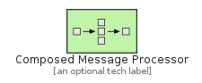
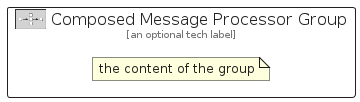

# ComposedMessageProcessor


```text
eip-1/MessageRouting/ComposedMessageProcessor
```

```text
include('eip-1/MessageRouting/ComposedMessageProcessor')
```


| Illustration | ComposedMessageProcessor | ComposedMessageProcessorGroup |
| :---: | :---: | :---: |
|  |  |  |


## ComposedMessageProcessor

### Load remotely
```plantuml
@startuml
' configures the library
!global $LIB_BASE_LOCATION="https://github.com/tmorin/plantuml-libs/distribution"

' loads the library's bootstrap
!include $LIB_BASE_LOCATION/bootstrap.puml

' loads the package bootstrap
include('eip-1/bootstrap')

' loads the Item which embeds the element ComposedMessageProcessor
include('eip-1/MessageRouting/ComposedMessageProcessor')

' renders the element
ComposedMessageProcessor('ComposedMessageProcessor', 'Composed Message Processor', 'an optional tech label')
@enduml
```

### Load locally
```plantuml
@startuml
' configures the library
!global $INCLUSION_MODE="local"
!global $LIB_BASE_LOCATION="../.."

' loads the library's bootstrap
!include $LIB_BASE_LOCATION/bootstrap.puml

' loads the package bootstrap
include('eip-1/bootstrap')

' loads the Item which embeds the element ComposedMessageProcessor
include('eip-1/MessageRouting/ComposedMessageProcessor')

' renders the element
ComposedMessageProcessor('ComposedMessageProcessor', 'Composed Message Processor', 'an optional tech label')
@enduml
```

## ComposedMessageProcessorGroup

### Load remotely
```plantuml
@startuml
' configures the library
!global $LIB_BASE_LOCATION="https://github.com/tmorin/plantuml-libs/distribution"

' loads the library's bootstrap
!include $LIB_BASE_LOCATION/bootstrap.puml

' loads the package bootstrap
include('eip-1/bootstrap')

' loads the Item which embeds the element ComposedMessageProcessorGroup
include('eip-1/MessageRouting/ComposedMessageProcessor')

' renders the element
ComposedMessageProcessorGroup('ComposedMessageProcessorGroup', 'Composed Message Processor Group', 'an optional tech label') {
    note as note
        the content of the group
    end note
}
@enduml
```

### Load locally
```plantuml
@startuml
' configures the library
!global $INCLUSION_MODE="local"
!global $LIB_BASE_LOCATION="../.."

' loads the library's bootstrap
!include $LIB_BASE_LOCATION/bootstrap.puml

' loads the package bootstrap
include('eip-1/bootstrap')

' loads the Item which embeds the element ComposedMessageProcessorGroup
include('eip-1/MessageRouting/ComposedMessageProcessor')

' renders the element
ComposedMessageProcessorGroup('ComposedMessageProcessorGroup', 'Composed Message Processor Group', 'an optional tech label') {
    note as note
        the content of the group
    end note
}
@enduml
```

