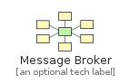
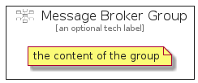

# MessageBroker


```text
eip-1/MessageRouting/MessageBroker
```

```text
include('eip-1/MessageRouting/MessageBroker')
```


| Illustration | MessageBroker | MessageBrokerGroup |
| :---: | :---: | :---: |
|  |  |  |


## MessageBroker

### Load remotely
```plantuml
@startuml
' configures the library
!global $LIB_BASE_LOCATION="https://raw.githubusercontent.com/tmorin/plantuml-libs/master/distribution"

' loads the library's bootstrap
!include $LIB_BASE_LOCATION/bootstrap.puml

' loads the package bootstrap
include('eip-1/bootstrap')

' loads the Item which embeds the element MessageBroker
include('eip-1/MessageRouting/MessageBroker')

' renders the element
MessageBroker('MessageBroker', 'Message Broker', 'an optional tech label')
@enduml
```

### Load locally
```plantuml
@startuml
' configures the library
!global $INCLUSION_MODE="local"
!global $LIB_BASE_LOCATION="../.."

' loads the library's bootstrap
!include $LIB_BASE_LOCATION/bootstrap.puml

' loads the package bootstrap
include('eip-1/bootstrap')

' loads the Item which embeds the element MessageBroker
include('eip-1/MessageRouting/MessageBroker')

' renders the element
MessageBroker('MessageBroker', 'Message Broker', 'an optional tech label')
@enduml
```

## MessageBrokerGroup

### Load remotely
```plantuml
@startuml
' configures the library
!global $LIB_BASE_LOCATION="https://raw.githubusercontent.com/tmorin/plantuml-libs/master/distribution"

' loads the library's bootstrap
!include $LIB_BASE_LOCATION/bootstrap.puml

' loads the package bootstrap
include('eip-1/bootstrap')

' loads the Item which embeds the element MessageBrokerGroup
include('eip-1/MessageRouting/MessageBroker')

' renders the element
MessageBrokerGroup('MessageBrokerGroup', 'Message Broker Group', 'an optional tech label') {
    note as note
        the content of the group
    end note
}
@enduml
```

### Load locally
```plantuml
@startuml
' configures the library
!global $INCLUSION_MODE="local"
!global $LIB_BASE_LOCATION="../.."

' loads the library's bootstrap
!include $LIB_BASE_LOCATION/bootstrap.puml

' loads the package bootstrap
include('eip-1/bootstrap')

' loads the Item which embeds the element MessageBrokerGroup
include('eip-1/MessageRouting/MessageBroker')

' renders the element
MessageBrokerGroup('MessageBrokerGroup', 'Message Broker Group', 'an optional tech label') {
    note as note
        the content of the group
    end note
}
@enduml
```

