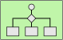

# MessageRouting

The module contains 11 items.

| |Name|
|:---:|---|
|  | [eip-1/MessageRouting/Aggregator](../../eip-1/MessageRouting/Aggregator.md) |
|  | [eip-1/MessageRouting/ComposedMessageProcessor](../../eip-1/MessageRouting/ComposedMessageProcessor.md) |
|  | [eip-1/MessageRouting/ContentBasedRouter](../../eip-1/MessageRouting/ContentBasedRouter.md) |
|  | [eip-1/MessageRouting/DynamicRouter](../../eip-1/MessageRouting/DynamicRouter.md) |
|  | [eip-1/MessageRouting/MessageBroker](../../eip-1/MessageRouting/MessageBroker.md) |
|  | [eip-1/MessageRouting/MessageFilter](../../eip-1/MessageRouting/MessageFilter.md) |
|  | [eip-1/MessageRouting/ProcessManager](../../eip-1/MessageRouting/ProcessManager.md) |
|  | [eip-1/MessageRouting/RecipientList](../../eip-1/MessageRouting/RecipientList.md) |
|  | [eip-1/MessageRouting/Resequencer](../../eip-1/MessageRouting/Resequencer.md) |
|  | [eip-1/MessageRouting/RoutingSlip](../../eip-1/MessageRouting/RoutingSlip.md) |
|  | [eip-1/MessageRouting/Splitter](../../eip-1/MessageRouting/Splitter.md) |

