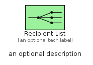
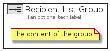

# RecipientList


```text
eip-1/MessageRouting/RecipientList
```

```text
include('eip-1/MessageRouting/RecipientList')
```


| Illustration | RecipientList | RecipientListGroup |
| :---: | :---: | :---: |
|  |  |  |


## Sprites
The item provides the following sriptes:

- `<$RecipientListXs>`
- `<$RecipientListSm>`
- `<$RecipientListMd>`
- `<$RecipientListLg>`


## RecipientList

### Load remotely
```plantuml
@startuml
' configures the library
!global $LIB_BASE_LOCATION="https://raw.githubusercontent.com/tmorin/plantuml-libs/master/distribution"

' loads the library's bootstrap
!include $LIB_BASE_LOCATION/bootstrap.puml

' loads the package bootstrap
include('eip-1/bootstrap')

' loads the Item which embeds the element RecipientList
include('eip-1/MessageRouting/RecipientList')

' renders the element
RecipientList('RecipientList', 'Recipient List', 'an optional tech label', 'an optional description')
@enduml
```

### Load locally
```plantuml
@startuml
' configures the library
!global $INCLUSION_MODE="local"
!global $LIB_BASE_LOCATION="../.."

' loads the library's bootstrap
!include $LIB_BASE_LOCATION/bootstrap.puml

' loads the package bootstrap
include('eip-1/bootstrap')

' loads the Item which embeds the element RecipientList
include('eip-1/MessageRouting/RecipientList')

' renders the element
RecipientList('RecipientList', 'Recipient List', 'an optional tech label', 'an optional description')
@enduml
```

## RecipientListGroup

### Load remotely
```plantuml
@startuml
' configures the library
!global $LIB_BASE_LOCATION="https://raw.githubusercontent.com/tmorin/plantuml-libs/master/distribution"

' loads the library's bootstrap
!include $LIB_BASE_LOCATION/bootstrap.puml

' loads the package bootstrap
include('eip-1/bootstrap')

' loads the Item which embeds the element RecipientListGroup
include('eip-1/MessageRouting/RecipientList')

' renders the element
RecipientListGroup('RecipientListGroup', 'Recipient List Group', 'an optional tech label') {
    note as note
        the content of the group
    end note
}
@enduml
```

### Load locally
```plantuml
@startuml
' configures the library
!global $INCLUSION_MODE="local"
!global $LIB_BASE_LOCATION="../.."

' loads the library's bootstrap
!include $LIB_BASE_LOCATION/bootstrap.puml

' loads the package bootstrap
include('eip-1/bootstrap')

' loads the Item which embeds the element RecipientListGroup
include('eip-1/MessageRouting/RecipientList')

' renders the element
RecipientListGroup('RecipientListGroup', 'Recipient List Group', 'an optional tech label') {
    note as note
        the content of the group
    end note
}
@enduml
```

