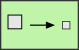
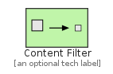
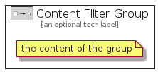

# ContentFilter


```text
eip-1/MessageTransformation/ContentFilter
```

```text
include('eip-1/MessageTransformation/ContentFilter')
```


| Illustration | ContentFilter | ContentFilterGroup |
| :---: | :---: | :---: |
|  |  |  |


## ContentFilter

### Load remotely
```plantuml
@startuml
' configures the library
!global $LIB_BASE_LOCATION="https://raw.githubusercontent.com/tmorin/plantuml-libs/master/distribution"

' loads the library's bootstrap
!include $LIB_BASE_LOCATION/bootstrap.puml

' loads the package bootstrap
include('eip-1/bootstrap')

' loads the Item which embeds the element ContentFilter
include('eip-1/MessageTransformation/ContentFilter')

' renders the element
ContentFilter('ContentFilter', 'Content Filter', 'an optional tech label')
@enduml
```

### Load locally
```plantuml
@startuml
' configures the library
!global $INCLUSION_MODE="local"
!global $LIB_BASE_LOCATION="../.."

' loads the library's bootstrap
!include $LIB_BASE_LOCATION/bootstrap.puml

' loads the package bootstrap
include('eip-1/bootstrap')

' loads the Item which embeds the element ContentFilter
include('eip-1/MessageTransformation/ContentFilter')

' renders the element
ContentFilter('ContentFilter', 'Content Filter', 'an optional tech label')
@enduml
```

## ContentFilterGroup

### Load remotely
```plantuml
@startuml
' configures the library
!global $LIB_BASE_LOCATION="https://raw.githubusercontent.com/tmorin/plantuml-libs/master/distribution"

' loads the library's bootstrap
!include $LIB_BASE_LOCATION/bootstrap.puml

' loads the package bootstrap
include('eip-1/bootstrap')

' loads the Item which embeds the element ContentFilterGroup
include('eip-1/MessageTransformation/ContentFilter')

' renders the element
ContentFilterGroup('ContentFilterGroup', 'Content Filter Group', 'an optional tech label') {
    note as note
        the content of the group
    end note
}
@enduml
```

### Load locally
```plantuml
@startuml
' configures the library
!global $INCLUSION_MODE="local"
!global $LIB_BASE_LOCATION="../.."

' loads the library's bootstrap
!include $LIB_BASE_LOCATION/bootstrap.puml

' loads the package bootstrap
include('eip-1/bootstrap')

' loads the Item which embeds the element ContentFilterGroup
include('eip-1/MessageTransformation/ContentFilter')

' renders the element
ContentFilterGroup('ContentFilterGroup', 'Content Filter Group', 'an optional tech label') {
    note as note
        the content of the group
    end note
}
@enduml
```

