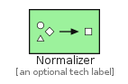
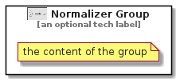

# Normalizer


```text
eip-1/MessageTransformation/Normalizer
```

```text
include('eip-1/MessageTransformation/Normalizer')
```


| Illustration | Normalizer | NormalizerGroup |
| :---: | :---: | :---: |
|  |  |  |


## Normalizer

### Load remotely
```plantuml
@startuml
' configures the library
!global $LIB_BASE_LOCATION="https://raw.githubusercontent.com/tmorin/plantuml-libs/master/distribution"

' loads the library's bootstrap
!include $LIB_BASE_LOCATION/bootstrap.puml

' loads the package bootstrap
include('eip-1/bootstrap')

' loads the Item which embeds the element Normalizer
include('eip-1/MessageTransformation/Normalizer')

' renders the element
Normalizer('Normalizer', 'Normalizer', 'an optional tech label', 'an optional description')
@enduml
```

### Load locally
```plantuml
@startuml
' configures the library
!global $INCLUSION_MODE="local"
!global $LIB_BASE_LOCATION="../.."

' loads the library's bootstrap
!include $LIB_BASE_LOCATION/bootstrap.puml

' loads the package bootstrap
include('eip-1/bootstrap')

' loads the Item which embeds the element Normalizer
include('eip-1/MessageTransformation/Normalizer')

' renders the element
Normalizer('Normalizer', 'Normalizer', 'an optional tech label', 'an optional description')
@enduml
```

## NormalizerGroup

### Load remotely
```plantuml
@startuml
' configures the library
!global $LIB_BASE_LOCATION="https://raw.githubusercontent.com/tmorin/plantuml-libs/master/distribution"

' loads the library's bootstrap
!include $LIB_BASE_LOCATION/bootstrap.puml

' loads the package bootstrap
include('eip-1/bootstrap')

' loads the Item which embeds the element NormalizerGroup
include('eip-1/MessageTransformation/Normalizer')

' renders the element
NormalizerGroup('NormalizerGroup', 'Normalizer Group', 'an optional tech label') {
    note as note
        the content of the group
    end note
}
@enduml
```

### Load locally
```plantuml
@startuml
' configures the library
!global $INCLUSION_MODE="local"
!global $LIB_BASE_LOCATION="../.."

' loads the library's bootstrap
!include $LIB_BASE_LOCATION/bootstrap.puml

' loads the package bootstrap
include('eip-1/bootstrap')

' loads the Item which embeds the element NormalizerGroup
include('eip-1/MessageTransformation/Normalizer')

' renders the element
NormalizerGroup('NormalizerGroup', 'Normalizer Group', 'an optional tech label') {
    note as note
        the content of the group
    end note
}
@enduml
```

