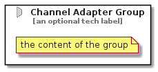

# ChannelAdapter


```text
eip-1/MessagingChannels/ChannelAdapter
```

```text
include('eip-1/MessagingChannels/ChannelAdapter')
```


| Illustration | ChannelAdapter | ChannelAdapterGroup |
| :---: | :---: | :---: |
|  |  |  |


## Sprites
The item provides the following sriptes:

- `<$ChannelAdapterXs>`
- `<$ChannelAdapterSm>`
- `<$ChannelAdapterMd>`
- `<$ChannelAdapterLg>`


## ChannelAdapter

### Load remotely
```plantuml
@startuml
' configures the library
!global $LIB_BASE_LOCATION="https://raw.githubusercontent.com/tmorin/plantuml-libs/master/distribution"

' loads the library's bootstrap
!include $LIB_BASE_LOCATION/bootstrap.puml

' loads the package bootstrap
include('eip-1/bootstrap')

' loads the Item which embeds the element ChannelAdapter
include('eip-1/MessagingChannels/ChannelAdapter')

' renders the element
ChannelAdapter('ChannelAdapter', 'Channel Adapter', 'an optional tech label', 'an optional description')
@enduml
```

### Load locally
```plantuml
@startuml
' configures the library
!global $INCLUSION_MODE="local"
!global $LIB_BASE_LOCATION="../.."

' loads the library's bootstrap
!include $LIB_BASE_LOCATION/bootstrap.puml

' loads the package bootstrap
include('eip-1/bootstrap')

' loads the Item which embeds the element ChannelAdapter
include('eip-1/MessagingChannels/ChannelAdapter')

' renders the element
ChannelAdapter('ChannelAdapter', 'Channel Adapter', 'an optional tech label', 'an optional description')
@enduml
```

## ChannelAdapterGroup

### Load remotely
```plantuml
@startuml
' configures the library
!global $LIB_BASE_LOCATION="https://raw.githubusercontent.com/tmorin/plantuml-libs/master/distribution"

' loads the library's bootstrap
!include $LIB_BASE_LOCATION/bootstrap.puml

' loads the package bootstrap
include('eip-1/bootstrap')

' loads the Item which embeds the element ChannelAdapterGroup
include('eip-1/MessagingChannels/ChannelAdapter')

' renders the element
ChannelAdapterGroup('ChannelAdapterGroup', 'Channel Adapter Group', 'an optional tech label') {
    note as note
        the content of the group
    end note
}
@enduml
```

### Load locally
```plantuml
@startuml
' configures the library
!global $INCLUSION_MODE="local"
!global $LIB_BASE_LOCATION="../.."

' loads the library's bootstrap
!include $LIB_BASE_LOCATION/bootstrap.puml

' loads the package bootstrap
include('eip-1/bootstrap')

' loads the Item which embeds the element ChannelAdapterGroup
include('eip-1/MessagingChannels/ChannelAdapter')

' renders the element
ChannelAdapterGroup('ChannelAdapterGroup', 'Channel Adapter Group', 'an optional tech label') {
    note as note
        the content of the group
    end note
}
@enduml
```

